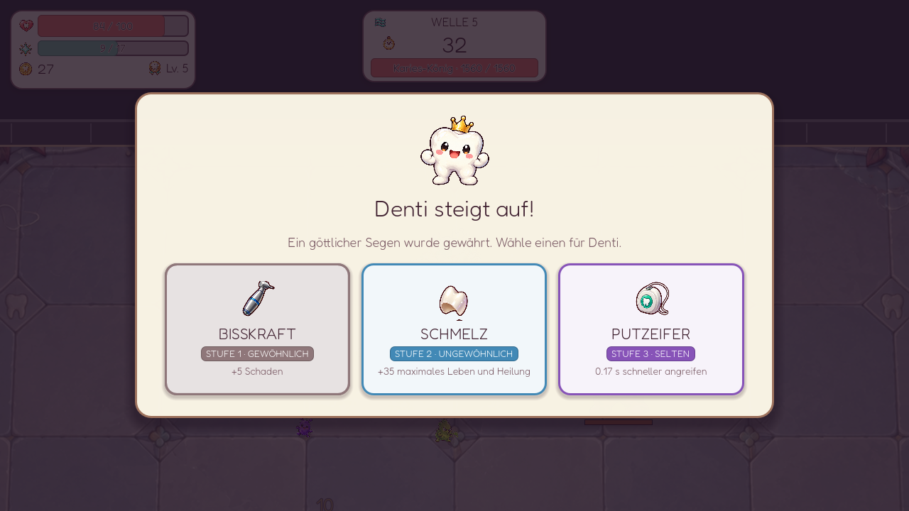
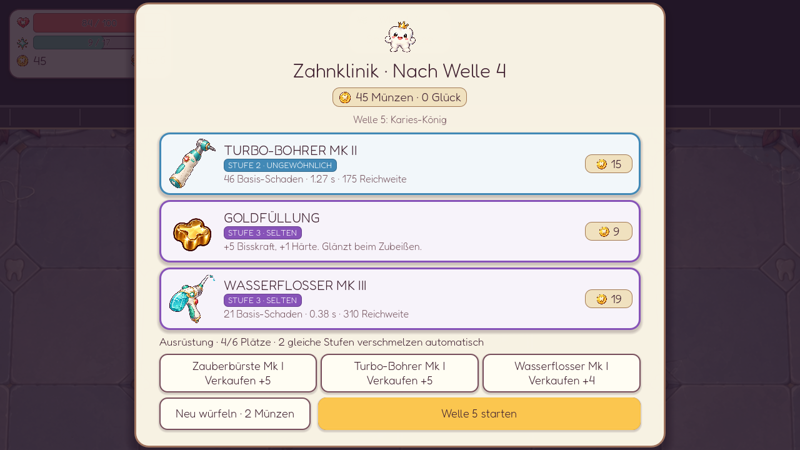
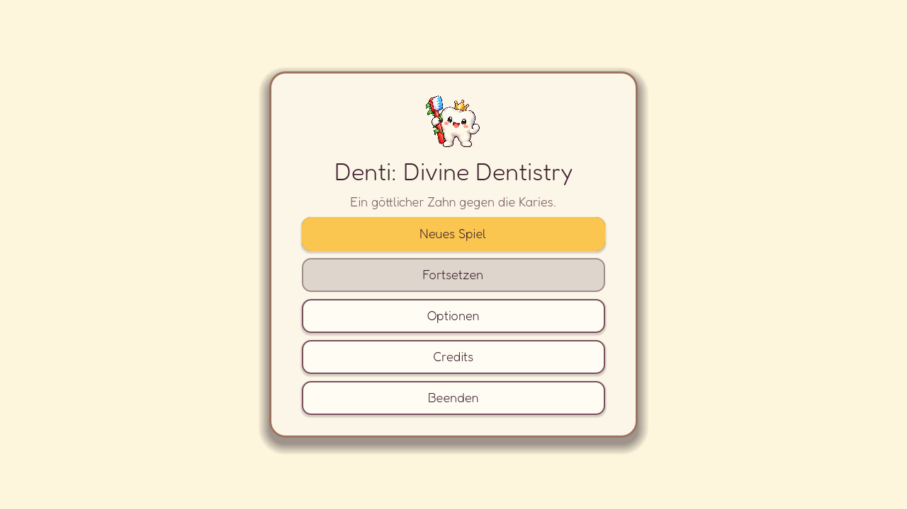

# Denti: Divine Dentistry

Ein kleiner 2D-Arena-Survivor über einen göttlichen Zahn, der Plaque, Zucker und Karies den Kampf ansagt. Denti bewegt sich von Hand; seine Waffen greifen automatisch an. Zwischen den Wellen entscheiden Levelaufstiege und Einkäufe, wie der nächste Kampf läuft.


## Ein Blick ins Spiel

| Bosskampf am Arenarand | Levelaufstieg |
| --- | --- |
| [](docs/screenshots/bosskampf.png) | [](docs/screenshots/levelaufstieg.png) |

| Shop zwischen den Wellen | Hauptmenü |
| --- | --- |
| [](docs/screenshots/shop.png) | [](docs/screenshots/hauptmenue.png) |

Die Bilder sind direkt aus Godot aufgenommen. Für die Kampfbilder wurden Gegner und Beute in einem separaten Testlauf arrangiert.

## Spielen

Das Projekt mit **Godot 4.4 oder neuer** öffnen und mit **F5** starten. Unter Linux geht es auch im Projektordner:

```bash
./play.sh
```

`play.sh` nutzt `/usr/local/bin/godot`, falls vorhanden, sonst `godot` aus dem `PATH`. Mit `DENTI_GODOT_BIN=/pfad/zu/godot ./play.sh` lässt sich eine andere Installation wählen. `./play.sh --probe` misst die Bildrate im Fenster, im Vollbild und mit 100 Gegnern.

| Eingabe | Aktion |
| --- | --- |
| WASD oder Pfeiltasten | Denti bewegen |
| Escape | Pause, Stats und Optionen öffnen |
| Maus | Waffen, Boni und Shopangebote wählen |

Zu Beginn wählst du eine Startwaffe. Im Kampf sammelst du XP für einen von drei Stat-Boni und Münzen für den Shop. Am Wellenende fliegt verbliebene Beute erst zu Denti; danach folgen Levelaufstiege und Shop. Dort kannst du Waffen und Items kaufen oder die drei Angebote neu würfeln. Waffen und Boni haben vier farblich markierte Stufen. Zwei gleiche Waffen derselben Stufe verschmelzen automatisch bis Stufe IV. Höheres Glück erhöht die Chance auf seltene Angebote und Boni; Waffen, die du schon trägst, erscheinen häufiger. Items können sich stapeln und bilden Kombinationen aus Blutung, Flächenschaden, Schild, Heilung und Münzgewinn. Unter **Escape → Items** siehst du den aktuellen Build. Alle Effekte stehen in der [Item-Übersicht](docs/items.md).

## Was schon spielbar ist

- **20 Wellen à 45 Sekunden** mit zunehmender Gegnerzahl und Stärke. In den Wellen 5, 10 und 15 wartet der Karies-König; Welle 20 endet mit dem Karies-Imperator. Die Bosse kündigen Anstürme auf dem Arenaboden an, setzen Flächenpulse ein und werden bei halbem Leben schneller.
- **Vier normale Gegnertypen**, die schrittweise hinzukommen, darunter ein Säurespucker mit angekündigtem Fernangriff. Einzelne Wellen bringen zusätzlich Horden eines Typs.
- **Acht Waffen und 18 Shop-Items** für unterschiedliche Builds. Items können sich innerhalb ihrer Stapellimits ergänzen; der Shop bevorzugt gelegentlich Angebote mit passenden Eigenschaften zu deinem Build. Levelaufstiege verbessern acht Grundwerte. Waffenkarten zeigen Schaden, Angriffszeit und Reichweite der jeweiligen Stufe.
- Eine **scrollende Arena**, größer als der Bildschirm, mit Mauer und dunklem Außenbereich. Das kompakte HUD zeigt Leben, XP, Münzen, Welle und verbleibende Sekunden.
- Automatisches Speichern während des Laufs. **Fortsetzen** lädt ihn auch nach einem Neustart; ein neues Spiel fragt vor dem Überschreiben nach.
- Musik für Menü, Wellen und Bosse, Kampfgeräusche sowie Regler für Gesamt-, Musik- und SFX-Lautstärke. Eine FPS-Anzeige lässt sich einschalten.

Das Spiel ist ein **spielbarer Prototyp**. Balancing, Effekte und weitere Inhalte sind noch in Arbeit.

Die aktuelle Entwicklungsrichtung für v0.2 ist **Pressure + Build Depth**: mehr Gegnerdruck, häufigere Horden, Bullet-Hell-Muster, besseres Boss-Balancing, seltene Item-Kisten mit Behalten/Scrappen und deutlich mehr Synergien. Details stehen in der [v0.2-Roadmap](docs/ROADMAP.md).

## Entwicklung

Nach dem ersten Godot-Import lassen sich die Tests so ausführen:

```bash
for test in tests/*.gd; do
  godot --headless --fixed-fps 60 --path . --script "res://$test" || exit 1
done
```

Die README-Screenshots lassen sich mit einem separaten temporären Spielstand neu aufnehmen:

```bash
godot --path . --script res://tools/capture_readme.gd
```

Das Aufnahmeskript schreibt nach `docs/screenshots/` und verändert den normalen Spielstand nicht. Hinweise zu Grafiken, Musik, Sound und Schrift stehen in [CREDITS.md](CREDITS.md).
