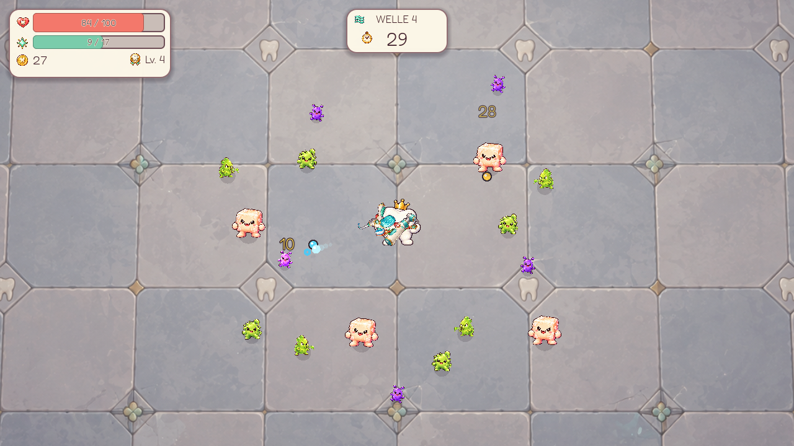
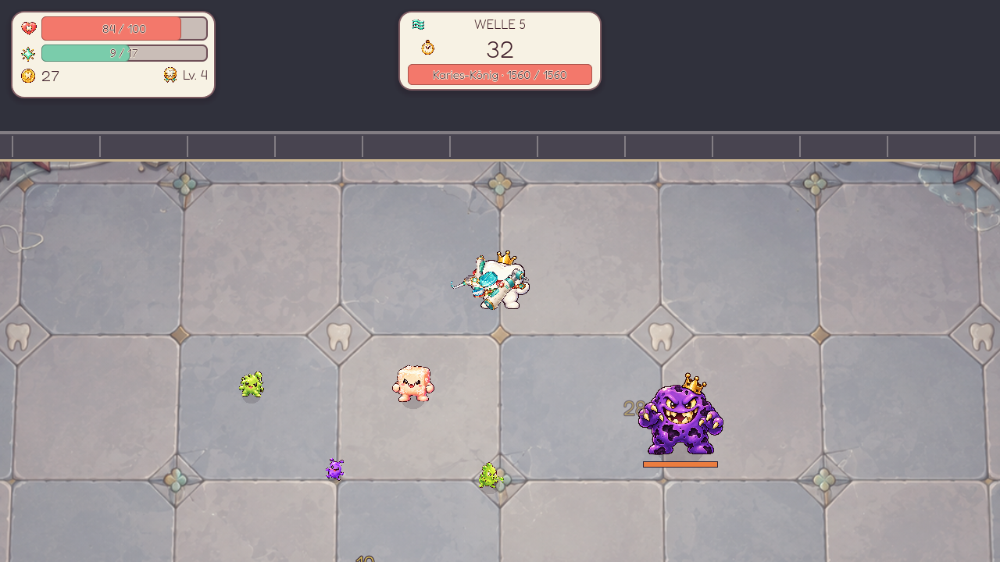
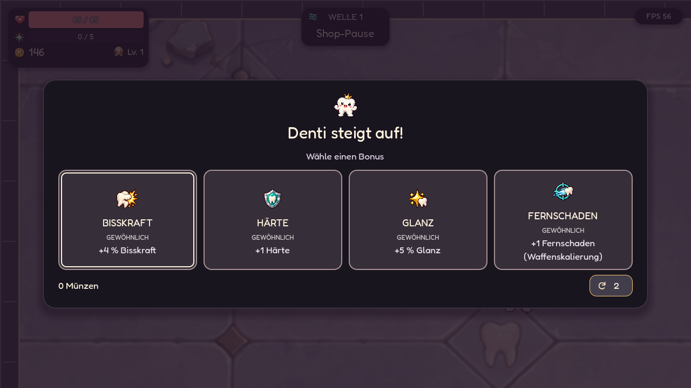
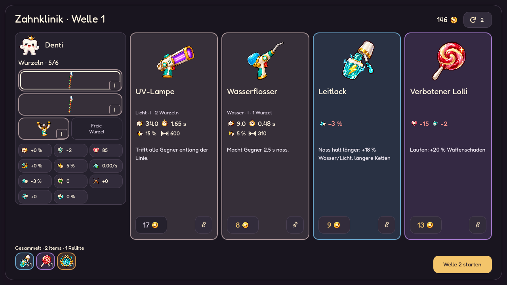
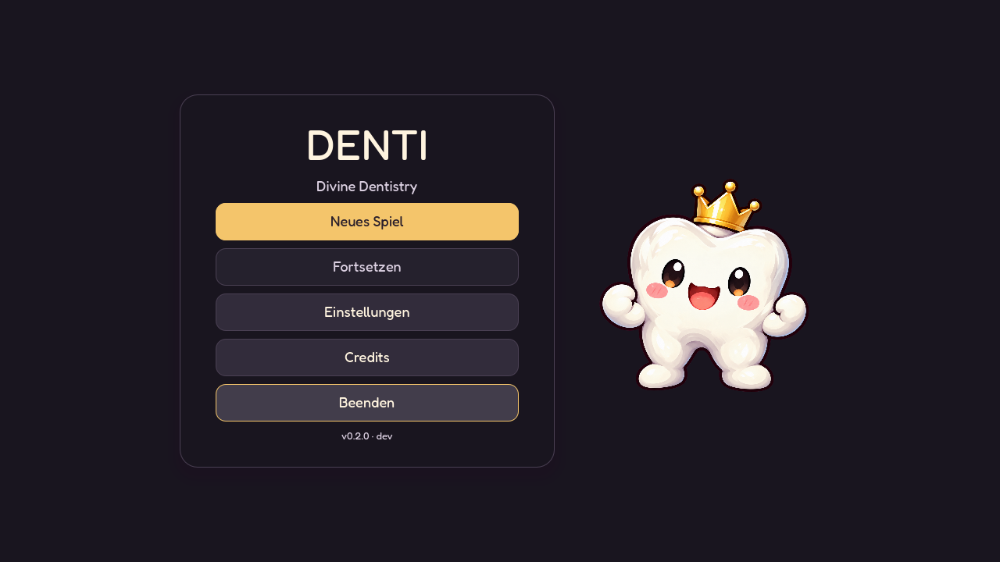
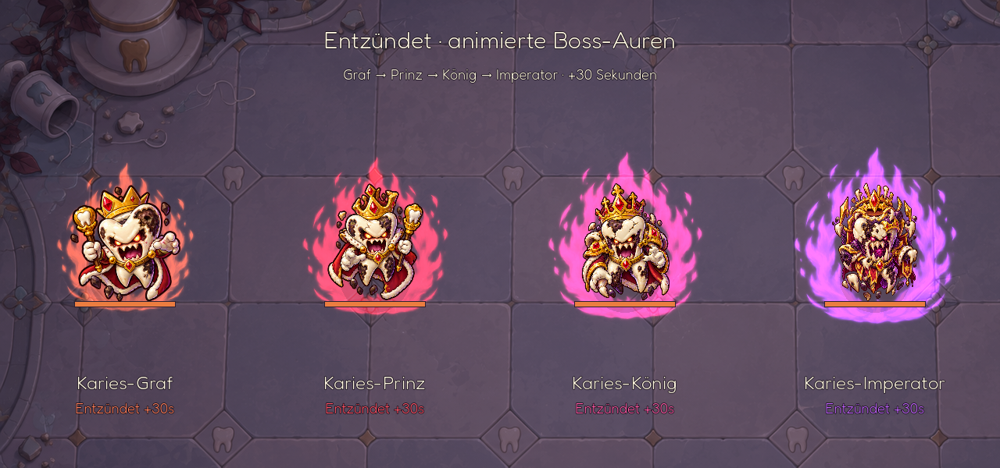
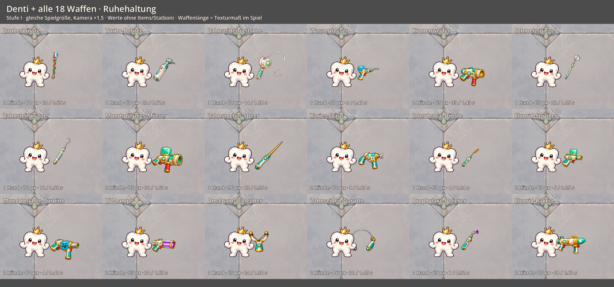

# Denti: Divine Dentistry

Ein kleiner 2D-Arena-Survivor über einen göttlichen Backenzahn, der Plaque, Zucker und Karies den Kampf ansagt. Du steuerst Denti direkt; seine Waffen greifen automatisch an. Zwischen den Wellen entscheiden Levelaufstiege und Einkäufe, wie der nächste Kampf läuft.

**Aktuelle Version: 0.2.0 · Pressure + Build Depth.** Alle Änderungen seit 0.1 stehen in der [Patchnote-Historie](CHANGELOG.md).



## Ein Blick ins Spiel

| Bosskampf am Arenarand | Levelaufstieg |
| --- | --- |
| [](docs/screenshots/bosskampf.png) | [](docs/screenshots/nightclinic_upgrade.png) |

| Shop zwischen den Wellen | Hauptmenü |
| --- | --- |
| [](docs/screenshots/nightclinic_shop_1280x720.png) | [](docs/screenshots/nightclinic_menu.png) |

Die Bilder sind direkt aus Godot aufgenommen. Für die Kampfbilder wurden Gegner und Beute in einem separaten Testlauf arrangiert. Die Nachtklinik zeigt die aktuelle dunkle Oberfläche mit vier Shopangeboten und vier Level-up-Boni.

[](docs/BOSS_INFLAMMATION.md)

Die vier Farbstufen der Boss-Entzündung. Die Vorschau zeigt einen Frame der Animation; für den direkten Vergleich sind die Bosse gleich groß dargestellt. [Details zur Entzündung](docs/BOSS_INFLAMMATION.md).

[](docs/WEAPON_SIZE_BALANCE.md)

[Alle Waffen in Ruhe und im Angriff](docs/WEAPON_SIZE_BALANCE.md), einschließlich Größenvergleich und Messungen zum kleineren, schnelleren Turbo-Bohrer.

[Neue Waffengrafiken und animierte Vorschau](docs/WEAPON_ART_REFINEMENT.md): klarere Geräteformen, separat rotierende Arbeitsköpfe und eine Schleuder mit beweglichen Gummibändern und Beutel.

## Spielen

Für Performance-Tests im Web-Build: Im Hauptmenü siebenmal **Einstellungen → Zurück**, dann **Code eingeben**. `debug map` startet die volle Welle-17-Testarena, `boss charge` den Boss-Test. Der normale Spielstand bleibt erhalten. [Testarenen und Messwerte](docs/TEST_ARENAS.md).

Das Projekt mit **Godot 4.4 oder neuer** öffnen und mit **F5** starten. Unter Linux geht es auch im Projektordner:

```bash
./play.sh
```

`play.sh` nutzt `/usr/local/bin/godot`, falls vorhanden, sonst `godot` aus dem `PATH`. Mit `DENTI_GODOT_BIN=/pfad/zu/godot ./play.sh` lässt sich eine andere Installation wählen. `./play.sh --probe` misst die Bildrate im Fenster, im Vollbild und mit 100 Gegnern.

| Eingabe | Aktion |
| --- | --- |
| WASD oder Pfeiltasten | Denti bewegen |
| Escape | Kartendetails schließen; sonst Pause, Stats und Einstellungen öffnen |
| F3 (Debug-Build) | Kampf-Telemetrie ein- und ausblenden |
| F4 (lokaler Debug-Build) | Testmenü: Waffen, Items, Münzen, Stats und Wellen |
| Maus | Waffen, Boni und Shopangebote wählen |
| Touchscreen | Auf der freien Spielfläche kurz in die gewünschte Richtung ziehen und den Finger halten: Denti läuft weiter. Nachziehen ändert die Richtung, Loslassen stoppt. Pause, Menüs und Shop per Tippen bedienen. |

Vor einem neuen Run wählst du **Easy, Normal oder Hard**; **Hell** wird nach einem Sieg auf Hard freigeschaltet. Der Grad bleibt beim Fortsetzen erhalten. Normal entspricht der bisherigen Balance, während die anderen Grade vor allem Gegnerdichte, Horden, Eliten und Projektilmuster verändern.

Zu Beginn wählst du eine Startwaffe. Im Kampf sammelst du XP und Münzen. Erreichte Level werden vorgemerkt, ohne die Welle anzuhalten. Selten kann eine Zahnfee-Kiste fallen; auch ihr Einsammeln unterbricht den Kampf nicht. Am Wellenende fliegt verbliebene Beute erst zu Denti. Danach wählst du für jedes erreichte Level einen von vier Stat-Boni und entscheidest bei jeder Kiste, ob du das Item behältst oder für Münzen zerlegst. Nach den Bossen in Welle 5, 10 und 15 wählst du außerdem eines von drei göttlichen Relikten. Erst dann öffnet der Shop. Dort kannst du Waffen und Items kaufen oder die vier Angebote neu würfeln oder kostenlos mit Preisbindung merken. Waffen und Boni haben vier farblich markierte Stufen. Items bieten 17 Familien von Common bis Legendary und neun einmalige Mythics ohne Nachteil; Varianten teilen ein Familienlimit. Gleiche Waffen bleiben bei freien Plätzen einzeln ausgerüstet; bei voller Ausrüstung verschmilzt ein passender Kauf. Angebote öffnen zunächst ihre Details; der Preisbutton auf jeder Karte kauft direkt. Nicht kaufbare Angebote bleiben inspizierbar, ihr Preisbutton wird ausgegraut. Tippe eine belegte Wurzel an, um die Waffe zu vergleichen, mit einem passenden Exemplar zu fusionieren oder nach Bestätigung zu verkaufen. Fusionen reichen bis Stufe IV; Rechtsklick bleibt als Abkürzung erhalten. Die gesammelten Items und Relikte stehen unten als Icons mit Anzahl, Effekt beim Hover und Details per Antippen. Auf kleinen Bildschirmen ordnet der Shop Angebote und Details untereinander an und hält die Aktionen erreichbar. Höheres Glück erhöht innerhalb fester Grenzen die Chance auf Kisten, seltene Angebote und Boni; Waffen, die du schon trägst, erscheinen häufiger. Items können sich stapeln und bilden Kombinationen aus Blutung, Flächenschaden, Schild, Heilung und Münzgewinn. Unter **Escape → Stats** stehen die Werte und Waffen, unter **Escape → Items** die gesammelten Icons mit Anzahl und anwählbaren Effekten. Alle Effekte stehen in der [Item-Übersicht](docs/items.md) und der [Relikt-Übersicht](docs/relics.md).

## Was schon spielbar ist

Nach dem Sieg in Welle 20 kannst du **Endlos weiterspielen** wählen. Dein Sieg und Build bleiben erhalten; der Shop führt anschließend in Welle 21. Endloswellen dauern 60 Sekunden, Gegner und Preise steigen stärker, und Welle 30/40/... bringt zwei Bosse. Auch Endlosruns lassen sich speichern und fortsetzen. [Brotato-Vergleich, Balancekurve und Vorschau](docs/ENDLESS_MODE.md).

Auf Normal fällt Gold in Welle 1–4 garantiert und sinkt bis Welle 20 auf 70 % Drop-Chance. Goldsonde und Goldextraktor ermöglichen wertvollere Drops; Level-up-Angebote lassen sich gegen Münzen neu würfeln. XP bleibt unabhängig. Shoppreise steigen nach der Brotato-Kurve; gemerkte Angebote behalten ihren Preis. Die neue Economy, vier Auswahlkarten und die Messungen sind in [ECONOMY_BALANCE.md](docs/ECONOMY_BALANCE.md) dokumentiert.

- **20 Wellen mit variabler Dauer**: frühe Wellen dauern 35–44 Sekunden, späte normale Wellen bis zu 50 Sekunden; Bosswellen bleiben bei 45 Sekunden. Horden, Bursts und Eliten richten sich zeitlich nach der jeweiligen Wellenlänge. Die Boss-Dynastie steigert sich in Welle 5 vom **Karies-Grafen** über den **Karies-Prinzen** in Welle 10 und den **Karies-König** in Welle 15 bis zum **Karies-Imperator** in Welle 20. Jeder Rang hat ein eigenes Sprite und zunehmend dichtere Fächerschüsse, Projektilringe, schnellere Attacken und mehr Verstärkung. Bosse haben zwei kurze Schutzphasen, kündigen Anstürme an, setzen Flächenpulse ein und werden bei halbem Leben schneller. Überleben sie das Zeitlimit, beginnt der Zustand **Entzündet**: pro voller Sekunde steigen Schaden und Verteidigung um 5 %, Bewegungs-/Projektiltempo um 3 %, Angriffstempo um 4 % und Lebenspunkte um 2 % der Ausgangswerte. Aktuelle und maximale Lebenspunkte wachsen im gleichen Verhältnis; der Boss wird nicht voll geheilt. Warnzeiten bleiben erhalten. Eine animierte Energie-Aura umgibt den Zahn: orange beim Grafen, rot beim Prinzen, pink beim König und violett beim Imperator. Sie wird während der Entzündung stärker; ihre sichtbare Größe bleibt begrenzt. Das HUD zeigt die Entzündungs-Sekunden; Fortsetzen bewahrt die Eskalation und Aura. Details stehen in [Boss-Entzündung](docs/BOSS_INFLAMMATION.md).
- **Sechs normale Gegnertypen** und zwei Eliten, die schrittweise hinzukommen. Der Säurespucker kündigt seine Schüsse an; das zähe Zuckerstück startet ab Welle 7 einen langen Ansturm mit markiertem Einschlagbereich. Ab Welle 8 kann die Säurekrone als Elite mit angekündigtem Projektilring erscheinen. Ab Welle 12 bringt der Jagdkeim drei Bakterien mit, beschleunigt nahe Gegner und stürmt selbst an. Beide Eliten haben einen sichtbaren Schmelzschild gegen hohen Schaden in kurzer Zeit. Giftkeim (Giftschuss-Fächer) und Zahnfleischbeißer (Blutungsansturm) ergänzen den Spawnmix mit eigenen Sprites. Einführung, Häufigkeit und Statuseffekte skalieren je Schwierigkeit; spätere gewöhnliche Gegner und Eliten können eine erkennbare Gift-/Blutungseigenschaft tragen. [Regeln und Messungen](docs/PLAYER_STATUS_EFFECTS.md). Normale Wellen variieren ihre Gegnerverteilung durch die Profile Schwarm, Kreuzfeuer, Ansturm oder Zuckerflut. Das Profil verändert nur die Gegnerverteilung im normalen Spawnmix; Bosswellen, Spawnrate und Gegnerwerte bleiben davon unberührt. Wellen enthalten zusätzlich mehrere zeitlich variierende Gegnergruppen; ab Welle 6 kommen zum Schluss weitere Säurespucker und ab Welle 12 in normalen Wellen ein zusätzlicher Druckschub. Plaque bleibt leicht zu besiegen, während Zuckerstück und Säurespucker später stärker wachsen und häufiger erscheinen. In späteren Wellen schießen Säurespucker dichtere Fächer. Ab Welle 11 erscheinen mehrere Elite-Gruppen pro normaler Welle; später treten bis zu drei Eliten gleichzeitig auf. Einzelne Wellen bringen außerdem größere Themenhorden. Mehr Kills bedeuten in späten Wellen nicht mehr garantiert mehr XP und Münzen.
- **18 Waffen und 93 Shop-Items** für unterschiedliche Builds. Stichlinien, Frontbögen, Sprühkegel, Ziel-Fokus und durchdringende UV-Strahlen erweitern die bisherigen Angriffe. Fluorid-Spray bereitet Gegner für Schmelzschaden vor; Turbine und Polierer ergänzen Wasser- und Crit-Builds. Items können sich innerhalb ihrer Stapellimits ergänzen; der Shop bevorzugt gelegentlich Angebote mit passenden Eigenschaften zu deinem Build. Levelaufstiege verbessern elf Grundwerte, einschließlich Zahnflutsch (Ausweichen). Waffenkarten zeigen Rolle, Treffer, Angriffspause und Reichweite mit den aktuellen Buildwerten. Die Details ergänzen Crit, Effekte, Synergien und Vergleich.
- **Seltene Zahnfee-Kisten** mit höchstens einem normalen Zufallsfund pro Welle. Ihr Item und der Zerlegewert stehen beim Drop fest; die Entscheidung fällt nach der Welle.
- **Fünf göttliche Relikte** mit besonderen Effekten für Blutung, Wasser, Schild, kritische Treffer und Bewegung. Nach den ersten drei Bossen erscheint jeweils eine Auswahl aus drei noch nicht gewählten Relikten.
- **Story-Modus** im Hauptmenü: Denti landet durch den Hilferuf der Zahnfee außerhalb des Mundes. Vier Schauplätze mit Bossabschlüssen, kurzen Übergangsdialogen und einem Reisezeitstrahl führen durch die 20 Wellen. Zukünftige Welten werden erst bei Ankunft enthüllt. [Ablauf, Assets und Prüfung](docs/STORY_MODE.md).
- Eine **scrollende Arena**, größer als der Bildschirm, mit Mauer und dunklem Außenbereich. Das kompakte HUD zeigt Leben, XP, Münzen, Welle und verbleibende Sekunden.
- Automatisches Speichern während des Laufs. **Fortsetzen** lädt ihn auch nach einem Neustart; ein neues Spiel fragt vor dem Überschreiben nach.
- Musik für Menü, Wellen und Bosse, Kampfgeräusche sowie Regler für Gesamt-, Musik- und SFX-Lautstärke. Eine FPS-Anzeige lässt sich einschalten.
- **Nachtklinik:** dunkle Spielansichten, große Objektbilder und kompakte Iconwerte. Hover erklärt Werte, Klick öffnet Details oder das Dentikon. Kurze Hover-, Klick-, Kauf- und Fusionsreaktionen laufen auch in der Shop-Pause. UI-Klänge und reduzierte Bewegung werden unter **Escape → Einstellungen** gespeichert; Kauf, Pins, Preisbindung, Vergleich, Verkauf und Fusion bleiben erhalten. [Gestaltung und Aufnahmen](docs/UI_ART_DIRECTION.md).

Das Spiel ist ein **spielbarer Prototyp**. Balancing, Effekte und weitere Inhalte sind noch in Arbeit.

**0.2.0 · Pressure + Build Depth** bündelt mehr Gegnerdruck, häufigere Horden, Bullet-Hell-Muster, neue Bossmechaniken, seltene Item-Kisten mit Behalten/Scrappen und mehr Synergien. Die [Patchnotes](CHANGELOG.md) beschreiben die Änderungen gegenüber 0.1.0. Weitere Balance-Arbeit und geplante Ausbaustufen stehen in der [Roadmap](docs/ROADMAP.md).

## Entwicklung

**F4** öffnet in lokalen Desktop-Debug-Builds das pausierende Testmenü. Dort lassen sich Waffen samt Stufe hinzufügen, ändern und entfernen, Items mit ihren normalen Stack-Limits hinzufügen sowie Münzen und Stats setzen. Wellen 1–20 starten direkt mit dem aktuellen Build und vollem Leben, einschließlich der jeweiligen Bosse. F4 oder Escape schließt das Menü und stellt den vorherigen Pausezustand wieder her. Änderungen werden im Run-Spielstand gespeichert; Web- und Release-Builds enthalten keinen zugänglichen Cheat-Modus.

Mit **F3** zeigt ein Debug-Build rollenden DPS, Kills pro Sekunde, Gegnerdichte, Spawns, durch das Gegnerlimit blockierte Spawns, erlittenen Schaden, Boss-Kampfzeit und Wellenbeute. Nach Sieg oder Niederlage zeigt der Run-Rückblick unter anderem Spieldauer, Kills, Schaden, Beute, Kistenentscheidungen sowie die stärksten Waffen und Synergien. Ein JSON-Bericht mit detaillierten Werten pro Welle wird zusätzlich unter `user://run_reports/` gespeichert. Darin stehen auch die mittlere und höchste Zahl gleichzeitig lebender Gegner, das Maximum feindlicher Projektile, Elite-Spawns und -Kills.

Ein reproduzierbarer Boss-/Projektil-Benchmark und der Vorher/Nachher-Vergleich
stehen im [Performance-Bericht](docs/PERFORMANCE_PROJECTILES.md).
Der [Performance-Audit vom 03.10.2026](docs/PERFORMANCE_AUDIT.md) optimiert zusätzlich
Gegnerabfragen, Spielerprojektile, Beute, Telemetrie und Trefferfeedback.
Die [zentrale Gegnerbewegung](docs/CENTRAL_ENEMY_MOTION.md) beschreibt den gemeinsamen Physikschritt, den Referenztest und Messungen mit sowie ohne Diagnoseinstrumentierung.
Der [Spielerprojektil-Pool](docs/PLAYER_PROJECTILE_POOL.md) bereitet Geschosse vor dem Kampf vor und verwendet deren Nodes und Sprites erneut; der Bericht enthält Lebenszyklus-Benchmark und Save/Resume-Prüfungen.
Der [gemeinsame Gegner-Atlas](docs/ENEMY_SPRITE_ATLAS.md) reduziert Texturwechsel mit den bisherigen Sprites; Bildvergleich und Messungen prüfen Darstellung und Renderaufwand.
Die [häufigen Kampfpfade](docs/COMBAT_HOT_PATHS.md) verwenden zentrale Statusbewegung und vorbereitete Text-/Grafikabfragen; der Bericht enthält gezielte CPU-Vergleiche und ihre Grenzen.
Unter **Einstellungen → Grafik** startet **Automatisch** mit voller Auflösung und
wechselt bei drei aufeinanderfolgenden Messfenstern von je mindestens einer
Sekunde mit durchschnittlich unter 20 FPS im Kampf für den Run auf Sparsam.
Die ersten drei Kampfsekunden, Pausen, Menüs und Hintergrund-Tabs zählen nicht.
**Sparsam** begrenzt die Renderauflösung und Schadenszahlen,
**Voll** verwendet die Bildschirmauflösung.

Putzeifer und Bewegung verwenden additive Prozentboni; Speichel zählt Regenerationspunkte mit langsamen HP-Ticks. Formeln, Level-up-Werte und die Umrechnung alter Spielstände stehen in [Tempo und Regeneration](docs/STATS_BALANCE.md). Bisskraft verstärkt Schaden prozentual; Nah- und Fernschaden ergänzen gewichteten Basisschaden. Härte reduziert Treffer prozentual. Formeln, Waffenkoeffizienten und gemessene Bosskämpfe stehen im [Schadens- und Verteidigungsbericht](docs/DAMAGE_DEFENSE_BALANCE.md).

Nach dem ersten Godot-Import lassen sich die Tests so ausführen:

```bash
python3 tools/run_tests.py --godot godot
```

Unter Windows können die Tests mit dem Godot-Konsolenprogramm ausgeführt werden
(Namen bei anderer Godot-Version anpassen):

```powershell
python tools/run_tests.py --godot Godot_v4.7.2-stable_win64_console.exe
```

Der Runner benötigt Python 3.10+ (keine Zusatzpakete). Er führt bis zu vier Tests parallel aus, mit getrennten Godot-Benutzerdaten und unverändertem Simulationsschritt von 1/60 Sekunde. `--jobs 1` läuft seriell; `--filter 'weapon_*'` wählt eine Teilmenge. Alle Tests bleiben Bestandteil des CI-Laufs. Fehlercodes, `SCRIPT ERROR:` und Zeitüberschreitungen lassen den Lauf fehlschlagen. Laufzeiten und Logs stehen unter `.godot/test_results.json` und `.godot/test_runs/`; CI zeigt die langsamsten Tests und lädt Logs als Artefakt hoch. [Details und Laufzeitvergleich](docs/TEST_RUNTIME.md).

Eine Vorschau aller neuen Waffen im Shop und ihrer Effekte im Kampf erstellt
`Godot_v4.7.2-stable_win64_console.exe --path . --script res://tools/preview_weapon_expansion.gd`
unter `docs/screenshots/weapon_expansion_*.png`, mit einem getrennten Testspielstand.

Die ursprünglichen README-Screenshots erzeugt:

```bash
godot --path . --script res://tools/capture_readme.gd
```

Das Aufnahmeskript schreibt nach `docs/screenshots/` und verändert den normalen Spielstand nicht. Hinweise zu Grafiken, Musik, Sound und Schrift stehen in [CREDITS.md](CREDITS.md).

Den responsiven Shop zeigt `Godot_v4.7.2-stable_win64_console.exe --path . --script res://tools/preview_shop_workbench.gd` mit getrenntem Testspielstand in Desktop-, Hoch- und Querformat.

Aktuelle Nachtklinik-Aufnahmen erzeugt `Godot_v4.7.2-stable_win64_console.exe --path . --fixed-fps 60 --script res://tools/preview_nightclinic.gd`: Shop und ausgeklappte Details in vier Größen, Hauptmenü, Einstellungen, HUD und Level-up. Der Testspielstand ist getrennt; Originalreferenzen bleiben erhalten.
