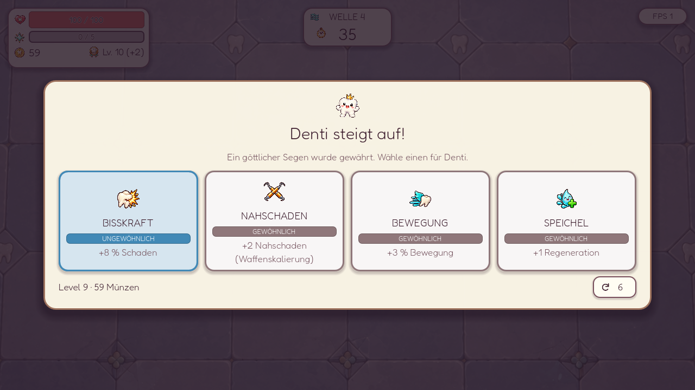

# Gold, Shoppreise und vier Auswahlkarten

Umgesetzt am 2026-10-01 auf Grundlage der [Untersuchung](ECONOMY_RESEARCH.md).

## Gold

Gold wird unabhängig von XP gewürfelt. Die bisherigen XP-Werte und deren Drop-Abschwächung bleiben bestehen. Plaque, Bakterien, Säurespucker und Zucker haben jetzt **100 % Basis-Münzchance**. Die ersten drei geben Wert 1, Zucker Wert 2. Eliten geben weiterhin garantiert 4 Münzen.

Der Gold-Faktor beträgt in Welle 1–4 100 %. Danach gilt `max(1 - 0,015 * Welle, 0,50)`, unabhängig davon, ob es eine Bosswelle ist. Auf Normal entspricht die tatsächliche Münzchance damit der [Brotato-Materials-Kurve](https://brotato.wiki.spellsandguns.com/Materials): Welle 5: 92,5 %, Welle 10: 85 %, Welle 20: 70 %. Die Untergrenze von 50 % wäre erst außerhalb unseres 20-Wellen-Runs relevant. Easy/Hard/Hell wenden weiterhin ihre Belohnungsfaktoren 1,15/0,9/0,8 an; Eliten bleiben garantiert. Boss-Kills selbst geben weiterhin Relikt-Fortschritt und keinen neuen Gold-Bonus.

Zuvor wurde die Wellenkurve zusätzlich mit Basiswerten von nur 40/45/50/65 % multipliziert. Bei Plaque blieben in Welle 20 so lediglich 28 % tatsächliche Münzchance. Der alte Startbonus entfällt: frühe Drops sind auf Normal bereits garantiert. Glück erhöht ohne Goldsonde weder die normale Drop-Chance noch den Münzwert.

Der zusätzliche Brotato-Hordenfaktor von 0,65 wird nicht übernommen: Dort gilt er für ganze Horde Waves, während Denti kurze Horden innerhalb einer Welle verwendet. XP bleibt ein eigenes System; die Brotato-Kopplung von Materials und XP übernehmen wir nicht.

## Zwei neue Economy-Items

| Item | Effekt pro Exemplar | Nachteil | Max. |
| --- | --- | --- | ---: |
| Goldsonde | 20 % Chance, den Basiswert eines tatsächlichen Münz-Drops zu verdoppeln | -5 % Bisskraft | 2 |
| Goldextraktor | +1 Münze bei Drops mit mindestens 2 Basis-Münzen, also Zucker und Eliten | -3 % Bewegung | 2 |

Die Goldsonde erhält zusätzlich einmal für den gesamten Effekt +1 Prozentpunkt je 10 Glück, höchstens +10 Prozentpunkte. Gesamtchance mit zwei Exemplaren: maximal 50 %. Der Extraktor prüft den ursprünglichen Gegnerwert: Eine verdoppelte normale Münze bekommt seinen Bonus nicht. Der Extraktorbonus selbst wird nicht verdoppelt. Mit beiden Items am Stapellimit ist der Drop daher 1/2 für normale Gegner, 4/6 für Zucker und 6/10 für Eliten.

Die Werte werden genau einmal beim Tod des Gegners festgelegt und als fertige Beute gespeichert. Aufsammeln, Wellenende und Fortsetzen würfeln sie nicht erneut. Goldfüllung verstärkt anschließend den tatsächlich eingesammelten Wert; ihre Bruchteile bleiben gespeichert. Die neuen Effekte gelten nicht für Kisten-Zerlegen, Waffenverkauf, Zinsen oder Kill-Boni. Beide Items haben Basispreis 10 und Stufe Ungewöhnlich.

Der transparente Atlas ergänzt die bestehenden gemalten Icons um Zellen 28/29. Beide Motive wurden gemeinsam mit ImageGen anhand von `item_icons_expansion_2.png` erzeugt, danach in vollständige 512×512-Zellen mit mindestens 56 Pixeln Rand gepackt. Die unveränderte Generierungsquelle liegt in `assets/items/reference/economy_icons_source.png`; `.gdignore` hält sie aus dem Spielimport. `tools/pack_economy_icons.py` reproduziert das Packen. Der vollständige [Generierungsprompt](ECONOMY_ICON_PROMPT.md) ist abgelegt.

## Level-up-Rerolls

Nach dem Loot-Sammeln hat jede Level-up-Auswahl einen kleinen Reload-Knopf mit Münzpreis. Links daneben stehen das gerade ausgewählte Level und der Münzbestand. Ein Reroll würfelt vier geeignete Stats neu und verbraucht weder XP noch eine ausstehende Auswahl. Es gilt weiter die Seltenheit des tatsächlich verdienten Levels, einschließlich der Meilensteine.

Unsere Kostenformel ist `max(2, ceil(verdientes Level / 2)) + bisherige Rerolls dieser Auswahl`. Beispiele: Level 2: 2/3/4/... Münzen, Level 5: 3/4/5/..., Level 10: 5/6/7/... und Level 20: 10/11/12/.... Die eigene Preisfolge wächst mit dem Spielverlauf und setzt beim nächsten ausstehenden Level zurück. Unbezahlbare Rerolls sind deaktiviert. Kampf, Startwaffe, Kiste, Relikt und Shop bieten keine Level-up-Rerolls.

Save/Resume bewahrt die vier konkreten Angebote, verbleibende Münzen und Rerollzahl; ältere Spielstände beginnen bei der ersten Rerollgebühr und behalten ihre gespeicherten Angebote. Die Telemetrie erfasst diese Ausgaben separat als `level_reroll`.

[Schmales Hochformat](screenshots/economy/economy_levelup_320x568.png) · [Kurzes Querformat](screenshots/economy/economy_levelup_568x320.png) · [Neue Items im Shop](screenshots/economy/economy_shop_1280x720.png)

## Shop

`Preis = floor(Basispreis * (1 + 0,1 * Welle) + Welle)`.

Die Welle ist die gerade abgeschlossene Welle, der erste Shop verwendet also 1. Für Waffen wird zunächst ihr Stufenpreis mit den bestehenden Faktoren 1/1,65/2,4/3,3 ermittelt und gerundet; darauf folgt genau einmal die Welleninflation. Katalog-Ressourcen und Itemeffekte werden nicht verändert, um Preise zu berechnen.

| Shop nach Welle | Zauberbürste I | Zauberbürste IV | Item mit Basispreis 5 |
| --- | ---: | ---: | ---: |
| 1 | 10 | 34 | 6 |
| 5 | 18 | 50 | 12 |
| 10 | 28 | 70 | 20 |
| 19 | 45 | 106 | 33 |

Stufe IV wird hier nur als Preisvergleich gezeigt, nicht als Angebot früher Shops.

Jeder Shop hat vier Angebote. „Merken“ reserviert ein Angebot kostenlos, auch wenn aktuell Münzen oder freie Wurzeln fehlen. Es bleibt beim Reroll und im nächsten Shop im selben Platz und behält seinen Preis. „Gemerkt“ gibt es wieder frei. Ein Kauf entfernt die Reservierung. Vier gemerkte Angebote sperren bezahlte Rerolls. Rerolls behalten die bisherige Kostenfolge 2/3/4/... und beginnen pro Shop erneut bei 2.

Save/Resume erhält alle vier Angebote, ihre exakten Preise, Reservierungen und Rerollkosten, auch während der folgenden Kampfwelle. Alte Shops mit drei Plätzen behalten ihre Angebote, ausverkauften Plätze und Preise; nur der vierte Platz wird ergänzt. Alte gespeicherte Level-ups mit drei Optionen bleiben erhalten, neue Level-ups bieten vier verschiedene geeignete Stats.

Kisten-Zerlegewerte bleiben zunächst bei 60 % des Item-Basispreises plus vorhandenen Itemboni. Waffenverkauf bleibt bei 50 % des tatsächlich investierten Kaufwertes. Diese Werte steigen daher nicht beide pauschal mit der Shopinflation.

## Darstellung

Level-ups bieten vier Karten nebeneinander auf breiten Bildschirmen, ein 2×2-Raster in kleineren Fenstern und vier Karten untereinander in hohem Hochformat. In kurzem Querformat werden das Maskottchen und der Erklärungstext ausgeblendet, um Platz für die vier Entscheidungen zu schaffen. Die Effekte bleiben sichtbar; ausführliche Texte stehen zusätzlich im Tooltip.

Der Shop zeigt ab 1000×560 vier kompakte Angebote nebeneinander über die gesamte Dialogbreite. Ausrüstung, Stats und der ausgewählte Vergleich stehen darunter. Die Karten zeigen Icon und Namen in einer Zeile sowie bis zu zwei Zeilen Kurzbeschreibung; vollständige Effekte stehen im Tooltip und in den Details. Kaufen und Merken liegen in senkrechten Karten unten nebeneinander, in waagerechten Listen rechts übereinander. Merken verwendet ein Pin-Icon; ein goldener Hintergrund kennzeichnet reservierte Angebote. Unterhalb dieser Breite wird ab 760 Pixeln ein 2×2-Raster verwendet, darunter eine scrollbare Liste.

Der Shopkopf zeigt nur Zahnklinik/Welle, Münzen und Glück; die zusätzliche Vorschau mit „Muster“ entfällt. Die ausgerüsteten Waffen unter „Wurzeln“ nutzen die verfügbare Breite und zeigen große Icons mit Stufen-Badge in der Ecke. Einzelplätze sind auf Desktop mindestens 80×80 Pixel groß; Waffen mit zwei Wurzeln nehmen zwei Wurzelplatzbreiten ein. Auf kleineren Bildschirmen passen sich die Slots an und bleiben bei Platzmangel seitlich scrollbar. Antippen, Verkaufen, Fusionieren und die vollständigen Waffen-Tooltips bleiben erhalten.

Die Karten haben pro Ansicht feste Höhen und reservieren je zwei Textzeilen für Titel und Kurzbeschreibung. Aktionen bleiben am unteren Kartenrand; unterschiedliche Texte und Preise verändern ihre Position oder Größe nicht. Der Kaufknopf ist 96 Pixel breit, der Pin in senkrechten Karten quadratisch und in waagerechten Listen ebenfalls 96 Pixel breit. Beide sind auf breiten Bildschirmen 40 Pixel hoch, sonst 44 Pixel. Shopkarten vergrößern sich beim Hover nicht, damit die Klickflächen stabil bleiben.

Der kleine Reload-Knopf sitzt rechts in der Angebotsüberschrift und zeigt den aktuellen Münzpreis; der Tooltip erklärt Rerolls und Reservierungen. Unten rechts steht ein kleiner Wellenstart-Knopf. Die gesammelten Items und Relikte bleiben als feste Icon-Leiste außerhalb der Angebots-/Detail-Scrollbereiche sichtbar: Icons mit Stapelzahl und getrennte Gesamtzahlen für Items und Relikte. Titel und vollständige Effekte stehen im Hover-Tooltip. Große Sammlungen scrollen seitlich; Antippen oder Tastaturauswahl öffnet ebenfalls die vollständigen Effekte. In schmalem Hochformat sitzt der Wellenstart unter der Item-Leiste. Ein leeres Inventar zeigt ausdrücklich „Keine Items“.

Automatisch geprüft wurden 320×568, 360×640, 568×320, 640×360, 540×960, 720×1280, 800×600, 1024×600, 1280×670, 1280×720 und 1920×1080 sowie der anschließende Wechsel zurück ins Hochformat. Der Layout-Test verwendet sechs belegte Wurzeln, alle 32 Items (eins davon doppelt) und drei Relikte. Er prüft die sichtbare Item-Leiste, Hover-Titel/-Effekte und Stapelzahlen, das Erreichen des letzten Relikts per Scrollen sowie die kompakten Reload-/Startknöpfe. Gemischte Titel, lange/mehrzeilige Texte, Preise von 5/100/1000/9999 und wechselnde Reservierungen müssen identische Aktionsgrößen und Baselines behalten. Karten, Text/Icon-Grenzen und Knöpfe werden auf Überschneidungen und Überläufe geprüft, auf breiten Bildschirmen auch alle Katalogtexte in den schmalen Karten. Gerenderte Ansichten bei 320×568, 720×1280, 1024×600, 1280×670 und 1280×720 wurden zusätzlich visuell geprüft.

## Messung und Grenzen

`tools/audit_economy.gd` erzeugt [Spawnplan-Erwartungswerte](economy_audit.json) für 30 Seeds. `tools/benchmark_economy.gd` erzeugt [Kampfmessungen](economy_combat_benchmark.json) für vier konfigurierte Builds mit je drei Seeds.

| Welle | Gold vorher | Gold jetzt | Zauberbürste I | Käufe jetzt, im Mittel |
| --- | --- | --- | ---: | ---: |
| 1 | 16 / 12 / 12 | 22 / 18 / 19 | 10 | 2,0 |
| 4 | 31 / 19 / 23 | 59 / 57 / 57 | 16 | 3,6 |
| 10 | 30 / 34 / 31 | 80 / 82 / 83 | 28 | 2,9 |
| 19 | 65 / 72 / 85 | 143 / 150 / 140 | 45 | 3,2 |

Die [Vorher-Messung](economy_combat_before_gold_update.json) wurde unmittelbar vor dieser Änderung mit denselben aktuellen Waffenprofilen durchgeführt. Die letzte Spalte teilt das Goldmittel durch den Preis einer Bürste I; sie zeigt eine Kaufkraft-Orientierung ohne Rerollausgaben, keine tatsächlichen Käufe. Stärkere Waffen und Items kosten mehr. Zusätzliche Economy-Items sind in diesen Messungen nicht ausgerüstet.

Die Messungen verwenden unsterbliches Denti, eine vorgegebene Ellipsenbewegung, konfigurierte Waffen/Stats und keine Economy-Items oder Shopkäufe. Sie erfassen eingesammeltes und bei Zeitablauf auf dem Boden liegendes Gold. Bosswelle 10 endet für die Messung am normalen Zeitlimit, nicht erst nach einem verlängerten Bosskampf. Die Builds belegen keine vollständige, erreichbare Kaufhistorie. Rendering-/Frame-Reihenfolge kann die Kampfmessung trotz festem Seed leicht verändern. Diese Ergebnisse prüfen die laufende Kampf- und Drop-Implementierung; manuelle Runs bleiben für die endgültige Balance erforderlich.

Die Telemetrie speichert pro Welle Einnahmequellen (Drops, Pickup-Items, Kill-Items, Zinsen, Kisten, Waffenverkauf) und Shopausgaben getrennt nach Waffen, Items und Rerolls. So lässt sich ein realer Run anschließend auf Kaufkraft untersuchen.

Die vollständige Testsuite mit 49 Skripten besteht. Neue Integrationstests prüfen bezahlte und unbezahlbare Rerolls, Reset pro ausstehendem Level, die separate Level-9-/Level-10-Seltenheit, alte und neue Save/Resume-Daten, Stapellimits, begrenzte Glücksboni, fertige Dropwerte und die Kombination mit Goldfüllung. Layoutprüfungen umfassen auch den sichtbaren Münzstand und Reload-Knopf bei allen oben genannten Auflösungen.

Quellen für die übernommenen Kurven: [Brotato Materials](https://brotato.wiki.spellsandguns.com/Materials), [Brotato Shop](https://brotato.wiki.spellsandguns.com/Shop).
