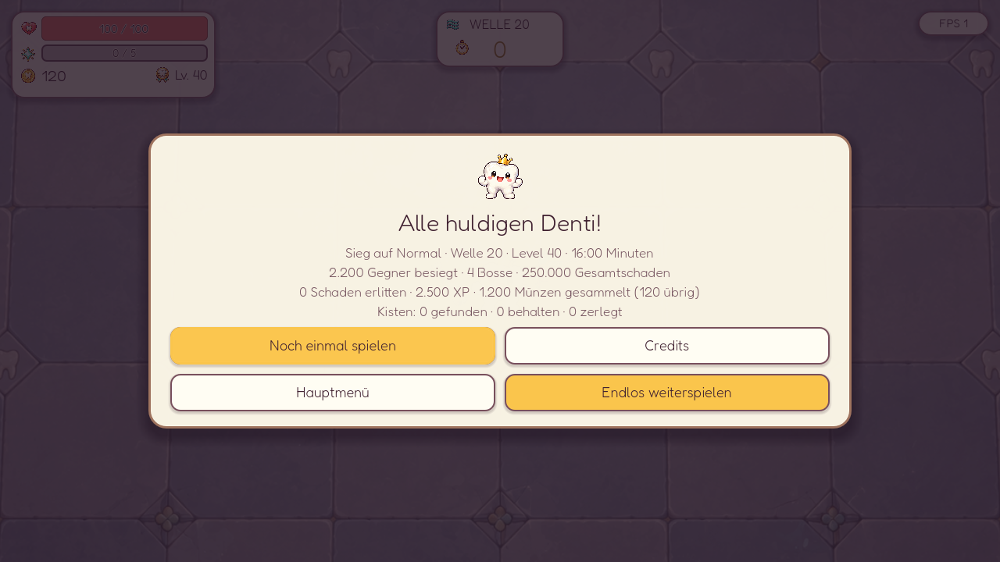
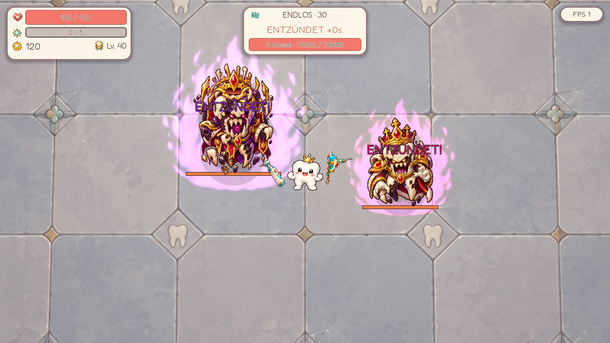

# Endlosmodus

Umgesetzt am 2026-10-01. Nach dem Sieg in Welle 20 bietet der Siegbildschirm **Endlos weiterspielen** an. Erst werden alle Level-ups und Kisten dieser Welle aufgelöst. Der Sieg und eine mögliche Hell-Freischaltung zählen bereits. Waffen, Items, Relikte, Münzen und Lebenspunkte bleiben erhalten; danach öffnet der Shop vor Welle 21. Es gibt keine kostenlose Vollheilung beim Wechsel.



[Hochformat 320×568](screenshots/endless/victory_320x568.png) · [Querformat 568×320](screenshots/endless/victory_568x320.png)

## Brotato als Vorbild

Brotato zählt den Sieg nach Welle 20 auch im Endlosmodus. Danach wachsen Gegnerwerte und Preise über einen gemeinsamen Faktor; ab Welle 36 beschleunigt sich die Kurve zusätzlich. Alle zehn Wellen erscheinen zwei Bosse. Ganze Hordenwellen entfallen, zusätzliche Eliten kommen hinzu. Harvesting und Piggy Bank werden eingeschränkt, ebenso die Treffer-Unverwundbarkeit. Quellen: [Endless Mode](https://brotato.wiki.spellsandguns.com/Endless_Mode), [Enemies](https://brotato.wiki.spellsandguns.com/Enemies).

Der übernommene Faktor lautet mit `n = max(Welle - 20, 0)`:

```text
E = n * (n + 1) / 200 * (2 + max((Welle - 35) * 0,2, 0))
Leben: 1 + 2,25 * E
Schaden: 1 + E
Tempo: 1 + min(E / 13,33, 1,75)
Shop: (Basispreis + Welle + 0,1 * Basispreis * Welle) * (1 + E / 5)
```

## Dentis Umsetzung

Die bisherigen Gegnergrundwerte steigen bis Welle 20. Ab Welle 21 dient genau dieser Stand als Basis für den Endlosfaktor, statt zusätzlich die bisherige späte Lebenskurve weiter zu multiplizieren. Die normale Verteidigung bleibt auf ihrem Welle-20-Stand. Entzündung und zeitlich begrenzte Schutzphasen wirken weiterhin separat.

| Welle | E | Leben × | Schaden × | Tempo × | Bürste I im Shop |
| --- | ---: | ---: | ---: | ---: | ---: |
| 20 | 0 | 1,00 | 1,00 | 1,00 | 47 |
| 21 | 0,02 | 1,05 | 1,02 | 1,002 | 49 |
| 25 | 0,30 | 1,68 | 1,30 | 1,023 | 59 |
| 30 | 1,10 | 3,48 | 2,10 | 1,083 | 80 |
| 35 | 2,40 | 6,40 | 3,40 | 1,180 | 111 |
| 40 | 6,30 | 15,18 | 7,30 | 1,473 | 192 |
| 50 | 23,25 | 53,31 | 24,25 | 2,744 | 587 |

Die Faktoren beziehen sich auf denselben Gegnertyp in Welle 20 und gelten vor Schwierigkeitsgrad und Entzündung. Shoppreise verwenden die **abgeschlossene** Welle und werden erst am Ende abgerundet; die Bürste hat Basispreis 9.

- Jede Endloswelle dauert 60 Sekunden. Bosswellen bleiben nach dem Zeitlimit aktiv, bis alle Bosse besiegt sind.
- Alle fünf Wellen erscheint ein Imperator. In Welle 30/50/... kommt ein König hinzu, in Welle 40/60/... ein Prinz. Beide erhalten ihre eigenen Werte, Schutzphasen und zur Größe passenden Entzündungs-Auren.
- Der HUD-Balken zeigt bei zwei Bossen ihr gemeinsames Leben. Die Bosskampf-Dauer misst bis zum letzten besiegten Boss; die Anzahl besiegter Bosse zählt jeden einzeln.
- Kürzere Spawnabstände erhöhen den Druck um `min(1 + E * 0,1, 2)`. Bursts und zusätzliche Elite-Gruppen bleiben aktiv. Pro Gruppe erscheinen höchstens vier Eliten, pro Burst höchstens 60 Gegner; die bestehende Obergrenze von 110 gleichzeitig lebenden Gegnern bleibt erhalten. Ganze Hordenwellen gibt es nach Welle 20 nicht.
- Welle 30/40/... bietet ein weiteres noch nicht besessenes Relikt aus dem bestehenden Pool. Sind alle fünf besessen, entfällt diese Auswahl.



[Doppelboss vor dem Zeitlimit](screenshots/endless/double_boss_wave30.png). Die Vorschauen verwenden arrangierte Testszenen und Beispielwerte für die Run-Zusammenfassung.

### Economy und Fortsetzen

Die Münzchance sinkt auf Normal bis zur Untergrenze von 50 % ab Welle 34; Eliten bleiben garantierte Drops. Goldsonde, Goldextraktor und die begrenzten Zinsen bleiben nutzbar. Treffer-Unverwundbarkeit und Angriffs-Warnzeiten behalten ihre bisherigen Regeln. Damit bleiben Economy-Builds und lesbare Ausweichfenster Teil des Runs.

Shop-Rerolls starten bei `max(2, ceil(2 * (1 + E / 5)))` und steigen je Kauf um `max(1, round(sqrt(1 + E)))`. Beispiele: Welle 30: 3/4/5/..., Welle 40: 5/8/11/.... Das ist eine eigene, mildere Rerollkurve. Gemerkte Angebote behalten ihren exakten Preis. Level-up-Rerolls bleiben an das tatsächlich verdiente Level gebunden.

Speichern und Fortsetzen erhält Endlosstatus, Wellen über 20, Build, Belohnungswarteschlange, Preise sowie beide Bosse einschließlich ihrer individuellen Entzündung. Alte Spielstände bleiben normale Runs. Beim Tod endet der Endloslauf; der Bericht enthält weiterhin den Sieg in Welle 20 und zusätzlich die erreichte Endloswelle sowie das Ende durch Tod.

## Messung und Prüfung

Alle **52 Testskripte** bestehen. Die drei neuen Tests prüfen Kurven und Grenzen, die vollständige Belohnungsfolge bis zur Endlosfortsetzung, Doppelboss-Tod und -Entzündung, Speichern/Fortsetzen, Preisbindung, Abschlussbericht und den Siegbildschirm von 320×568 bis 1920×1080. Gerenderte Vorschauen wurden zusätzlich im Desktop-, Hoch- und Querformat geprüft.

`tools/audit_endless.gd` erzeugt die [Kampfmessungen](endless_audit.json). Je drei Seeds, Normal, 1280×720, feste 60 Hz; ein unsterbliches Denti bewegt sich auf einer Ellipse. Der konfigurierte Build trägt fünf Tier-IV-Waffen, +60 % Bisskraft, 16 Nahschaden, 10 Fernschaden, +60 % Putzeifer und 12 Rüstung. Keine Items oder Shopkäufe.

| Welle | Spawns in 60 s | Kills | Gegner gleichzeitig, Spitze | Feindliche Projektile, Spitze |
| --- | --- | --- | --- | --- |
| 21 | 312 / 312 / 312 | 236 / 232 / 233 | 91 / 97 / 91 | 50 / 59 / 54 |
| 30 | 265 / 257 / 279 | 161 / 162 / 180 | 106 / 106 / 106 | 150 / 142 / 149 |
| 40 | 225 / 231 / 227 | 120 / 126 / 122 | 107 / 108 / 108 | 73 / 68 / 64 |

Weniger Spawns in höheren Wellen entstehen durch länger lebende Gegner und die gleichzeitige Gegnerobergrenze. Die Stichprobe belegt keine erreichbare Kaufhistorie und keine Überlebensfähigkeit. Bossmessungen stoppen am Timer vor der Entzündung, nicht beim Sieg; ein Bosskampf-Wert von 0 bedeutet hier keinen abgeschlossenen Kampf. Das künstlich hohe Leben beeinflusst die schadensabhängige Treffer-Unverwundbarkeit, daher eignen sich die erfassten Schadenswerte nicht zur Schätzung eines echten Überlebensruns. Frame-Reihenfolge kann trotz Seed leichte Unterschiede erzeugen. Die Kurve ist ein erster spielbarer Stand; echte Runs müssen insbesondere Kaufkraft und Bossdauer weiter prüfen.
