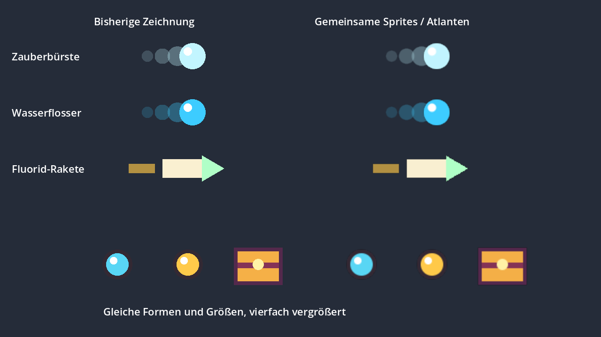
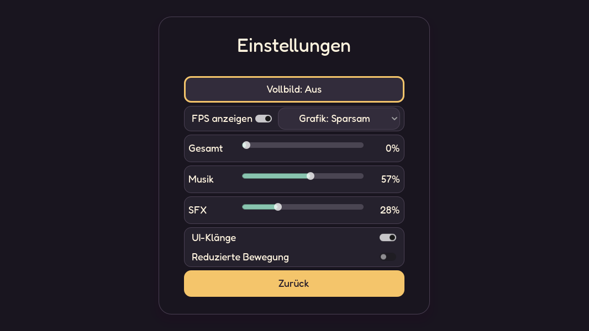

# Performance-Audit, 03.10.2026

## Ergebnis

Die größten gefundenen Kosten lagen in vollständigen Gegnerabfragen pro
Spielerprojektil, wiederholtem Summieren der Trefferhistorie und vielen einzelnen
Zeichenaufrufen für Beute. Diese Pfade sind optimiert. Gegnerlimits, Spawnraten,
Schaden, Beute und Bossmuster wurden für diese Arbeit nicht reduziert.

Unter **Einstellungen → Grafik** stehen **Automatisch**, **Sparsam** und **Voll**.
Automatisch wählt auf Touch-Geräten Sparsam, auf Desktop-Geräten Voll. Sparsam
rendert in der logischen Spielauflösung und skaliert das fertige Bild hoch; Voll
zeichnet in Bildschirmauflösung. Die vorhandenen mobilen Basisgrößen bleiben
720 × 1280 im Hochformat und 1040 × 600 im Querformat; breite Displays erweitern
weiterhin den sichtbaren Bereich. Touch-Koordinaten und UI-Layout bleiben gleich.
Die Auswahl wird in den Einstellungen gespeichert. Bei fehlender Touch-Erkennung
im Browser lässt sich Sparsam ausdrücklich auswählen.

Das nutzt Godots [Viewport-Stretching](https://docs.godotengine.org/en/stable/tutorials/rendering/multiple_resolutions.html#stretch-mode)
zur Begrenzung der Pixelarbeit. Es kann insbesondere auf hochauflösenden
Handybildschirmen helfen; die Darstellung wird dabei etwas weicher.

## Änderungen

- `EnemySpatialIndex` teilt Gegner in 128-Pixel-Zellen ein. Geschosse,
  Waffenziele, Nahkampfangriffe, Item-Procs, Relikte, Evolutionsflächen und
  Elite-Auren fragen passende Nachbarzellen ab. Die genauen Kreis-, Kegel- und
  Segmenttests bleiben erhalten. Die Spawnreihenfolge bleibt für Zielgleichstände
  und Proc-Ketten stabil. Rückstoß und Teleports aktualisieren den Index sofort;
  das Freigeben eines Gegners entfernt seine Referenzen.
- Einzelziel-Nahkampf prüft seinen bereits bekannten Gegner direkt.
  Bossabfragen verwenden die am Gegnercontainer registrierten Bosse statt
  wiederholt alle Gegnerkinder durchzugehen.
- Telemetrie hält laufende Schadenssummen vor. Treffer mit gleichem Zeitstempel
  teilen einen Eintrag. Verbrauchte Einträge werden über Lesepositionen und
  gelegentliche Kompaktierung entfernt. DPS-Abfragen laufen damit in konstanter
  Zeit. Alte Spielstände mit einem Eintrag pro Treffer bleiben lesbar.
- Spielerprojektile verwenden gemeinsame Texturen. Körper, pulsierender Rand
  und Schweif teilen einen Atlas; Explosionen bleiben animierte Ringe.
  XP, Münzen und Kisten teilen ebenfalls einen Atlas, einschließlich
  abwechselnd angeordneter Beutetypen.
- Gegner-Trefferblitze verwenden einen Timer statt eines neuen Tweens bei jedem
  Treffer. Das verhindert konkurrierende Fade-Tweens unter Dauerbeschuss.
- Das HUD aktualisiert sich während des Kampfes zehnmal pro Sekunde;
  die vorhandenen direkten Aktualisierungen bei Zustandswechseln bleiben.
  Unveränderte Timerfarben erzeugen keine neuen Theme-Overrides.
- Distanztests vergleichen überwiegend quadrierte Abstände. Die
  Beute-Magnetreichweite wird bei Itemänderung/Restore berechnet.
  Evolutionsgrafiken zeichnen sich nur neu, wenn visuelle Effekte laufen oder enden.
- Gewöhnliche Gegner-Schadenszahlen haben ein kosmetisches Budget von 120
  gleichzeitig aktiven Feedback-Nodes, im sparsamen Modus 40. Spielerschaden
  und wichtige Item-/Bossmeldungen umgehen dieses Budget. Treffer und
  Telemetrie werden unabhängig von der sichtbaren Zahl vollständig verarbeitet.





## Messungen

Godot 4.7.2, Windows, RTX 4070, Compatibility-Renderer, 1280 × 720,
VSync und FPS-Limit aus, normale 60-Hz-Physik. Gleicher Aufbau und Seed;
0,5 s Aufwärmen, danach 4 s Messung pro Szene. Die Zeitwerte sind tatsächliche
Abstände zwischen gerenderten Bildern. P95 ist die Grenze für 95 % der Bilder.

| Szenario | Mittel vorher | Mittel nachher | P95 vorher → nachher |
| --- | ---: | ---: | ---: |
| Leere Kampfszene | 0,65 ms | 0,63 ms | 0,81 → 0,81 ms |
| 400 Gegner, 360 Spielerprojektile | 826,71 ms | 6,21 ms | 828,56 → 10,78 ms |
| 1.800 Beutedrops, nach Nahbereichs-Pickups 1.703 übrig | 19,20 ms | 0,97 ms | 21,74 → 2,05 ms |
| 200 bewegte Gegner, sechs Nahkampfwaffen IV | 5,29 ms | 3,56 ms | 8,27 → 5,67 ms |

Die Beuteszene sinkt von **5.143 auf 35 Zeichenaufrufe**. Im Projektilstress sinkt
die Zahl von etwa **3.450 auf 880**. Der Nahkampf benötigt etwa ein Drittel weniger
mittlere Bildzeit; seine größte Spitze sinkt in dieser Messung von 180 auf 30 ms.

Eine Wiederholung der fertigen Version ergibt 6,40 ms für den Projektilstress,
0,97 ms für Beute und 3,72 ms für den Nahkampf. Der separate CPU-Test für 4.000
Telemetrie-Treffer samt Fensterablauf sinkt von **1.290,62 auf 3,97 ms**;
Gesamtschaden und abgelaufener DPS bleiben gleich.

Der Projektilstress liegt deutlich über dem normalen Gegnerlimit. Die Baseline
ist dort überlastet und schafft nur fünf Messbilder, einschließlich nachgeholter
Physikschritte. Der große Faktor beschreibt diesen Überlastfall; er ist keine
Aussage über einen gewöhnlichen Run oder Handy-FPS. Auch die Beuteszene ist ein
gezielter Extremtest. Die zusätzlich aufgezeichneten Godot-Prozess-/Physikmonitore
sind verzögert aktualisierte Engine-Werte und werden nicht als direkte
Bildzeitzerlegung verwendet.

Rohdaten: [Baseline](combat_performance_baseline.json),
[fertige Version](combat_performance_optimized.json),
[Wiederholung](combat_performance_optimized_repeat.json).

Der zusätzliche 20-Sekunden-Kampf in Hard-Welle 19 bei 2400 × 1080 verwendet
sechs Wasserflosser IV, acht Items, +100 % Schaden, 35 Fernschaden, 80 %
Angriffstempo und 35 % Crit; hohe Test-HP verhindern einen vorzeitigen Abbruch.
Er erreicht 82–87 Kills und verarbeitet Beute, Synergieeffekte und Autosaves.
Die mittlere Bildzeit beträgt in beiden Grafikmodi etwa 1,22 ms. P95 liegt bei
2,13 ms in Voll und 1,95 ms in Sparsam; die größten gemessenen Bilder bei 9,37
bzw. 6,83 ms. Das abschließende Speichern benötigt etwa 4,55 ms für 76–80 KB und
bewahrt die zwei bzw. drei ausstehenden Levelaufstiege.
Auf der RTX 4070 ist damit kein wesentlicher Gewinn der mittleren Bildzeit durch
die kleinere Renderauflösung belegt. Das ersetzt eine Messung auf einem Handy
mit schwächerer GPU nicht. Diese zwei Runs sind wegen unterschiedlicher
Bild-/Effektzeitpunkte auch keine identischen Kampf-Replays.
Rohdaten: [Voll](combat_performance_sustained_full.json),
[Sparsam](combat_performance_sustained_economy.json).

## Prüfung und Wiederholen

Alle **77 automatisierten Tests** bestehen. Neue Prüfungen vergleichen
räumliche Abfragen mit einer vollständigen Suche, einschließlich negativer
Koordinaten, großen Gegnern, Teleports, Rückstoß, Arena-Transformationen,
Trefferreihenfolge schneller Geschosse und Cleanup. Weitere Prüfungen decken
alte Telemetrie-Spielstände, Fenstergrenzen, gemeinsame Texturen,
Schadenszahlenbudgets, Grafikumschaltung, Persistenz und mobiles Layout ab.
Post-wave rewards, Touchsteuerung, Bosse, Items und Save/Resume bleiben durch
die vorhandenen Tests abgedeckt. Einige Godot-Testprozesse melden beim Beenden
noch ObjectDB-/Resource-Cleanup-Meldungen; alle Assertions und Exitcodes bestehen.

```powershell
& Godot_v4.7.2-stable_win64_console.exe --path . --script res://tools/combat_performance_probe.gd -- --label=local
& Godot_v4.7.2-stable_win64_console.exe --path . --script res://tools/combat_performance_probe.gd -- --sustained --label=local_full
& Godot_v4.7.2-stable_win64_console.exe --path . --script res://tools/combat_performance_probe.gd -- --sustained --economy --label=local_economy
```

Das Werkzeug verwendet einen eigenen Testspielstand und schreibt JSON nach
`docs/`. `--label` benennt die Datei, aktiviert aber keine ältere Implementierung.
`--sustained` misst einen 20-sekündigen Hard-Kampf in Welle 19 mit sechs
Wasserflossern IV, Item-Synergien und Autosave bei 2400 × 1080. Die Grafikoption
wird nur im Testprozess gesetzt, nicht in den normalen Einstellungen gespeichert.
`--headless` eignet sich für Funktionsprüfungen, nicht für diese Rendermessungen.

Die Vergleichsbilder erzeugt `res://tools/preview_combat_performance.gd`.
Ein echtes Handy oder ein mobiler Browser wurde hier nicht profiliert.
Autosave bleibt synchron; Browser-/Geräte-I/O, kalte Textur-/Shaderstarts und
sehr viele gleichzeitig aktive Synergie-Ringe bleiben sinnvolle Kandidaten für
die nächste Messung auf dem tatsächlich langsamen Gerät. Der lokale Web-Export
wurde mangels installierter Export-Templates nicht geprüft.
