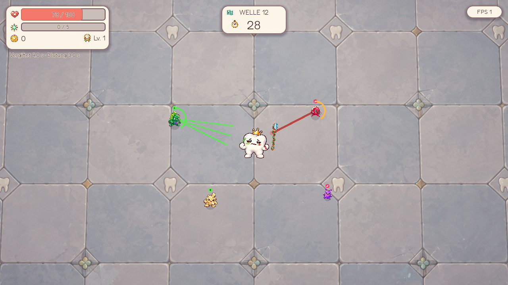

# Gift und Blutung bei Denti

Denti kann durch erfolgreiche Gegnertreffer **vergiftet** werden oder **bluten**. Beide Effekte verursachen einmal pro Sekunde Schaden und zeigen ihre Restzeiten unter dem HP-Bereich. Dentis Gesicht und kleine grüne Bläschen bzw. rote Tropfen spiegeln den tatsächlichen Zustand wider, auch wenn kurz eine Treffer-/Heilungsreaktion darüberliegt. Beide Effekte können gleichzeitig aktiv sein.

## Treffer, Schutz und Ablauf

- Dodge, Schild und bestehender Trefferschutz verhindern die **Anwendung**, weil nur ein tatsächlicher HP-Treffer einen Status überträgt. Ein abgewehrtes Geschoss verschwindet weiterhin.
- Bereits laufende Effekte sind nicht ausweichbar und verbrauchen keine Schilde oder Treffer-Unverwundbarkeit. Sie lösen keine Dornen-/Vergeltungsprocs aus. Heilung und Speichel wirken weiterhin normal.
- **Blutung** verwendet Dentis aktuelle Härte. **Gift** ignoriert Härte. Kleine Tickwerte bleiben anteilig; es gibt keine künstliche Mindestschadensgrenze von 1 HP für diese Ticks.
- Gleiche Effekte addieren keine Schadensstapel. Erneute Anwendung erhält den stärkeren Tickwert und die längere Restzeit. Der nächste Tick wird dabei nicht nach hinten verschoben. Maximal sechs Sekunden Dauer und zwölf rohe HP je Tick sind zulässig; die aktuellen Gegnerwerte liegen deutlich darunter.
- Tickzeit und Restdauer laufen nur während unpausierter Spielzeit. Schaden kann Denti töten; der letzte Tick wird vor dem Runbericht korrekt verbucht.
- Nach einem abgeschlossenen Kampf verschwinden die Effekte **vor der Beutesammlung**. Sie bleiben während Boss-Überzeit aktiv, weil der Kampf dann weitergeht. Shop und Belohnungsauswahl verursachen keinen Nachschaden.

## Neue Spezialisten

**Giftkeim:** dunkelgrüner Keim mit Giftsäcken und violetter Flaschenmarkierung. Hält ungefähr 245 Pixel Abstand. Sein Fächer aus drei langsamen Giftgeschossen (220 px/s) wird 0,75 Sekunden vorher angezeigt. Basis: 45 HP, Bewegung 85, Kontaktschaden 4, Geschossschaden 5. Gift: 2 rohe HP je Sekunde für vier Sekunden, vor Wellen-/Schwierigkeitsanpassung.

**Zahnfleischbeißer:** kleiner roter Keim mit auffälligen Zahnspitzen und Fangzähnen. Kündigt einen kurzen Ansturm 0,65 Sekunden vorher an; die Richtung steht während der Warnung fest. Basis: 30 HP, Bewegung 118, Kontaktschaden 5, Ansturmschaden 7, Ansturm 440 px/s für 0,28 Sekunden. Blutung: 2 rohe HP je Sekunde für drei Sekunden, vor Anpassung und Härte.

Die neuen Gegner haben eigene gemalte PNGs und individuelle HP-Kurven. Sie teilen das bestehende Spawnlimit und ersetzen einen Teil des normalen Spawnmixes. Sie erzeugen keine zusätzlichen garantierten Horden oder Kisten.

Giftkeim, Zahnfleischbeißer, Säurespucker und Säurekrone spiegeln ihre gerichteten Grafiken entsprechend der tatsächlichen Bewegung, auch beim Rückzug und Ansturm. In der Angriffswarnung schauen sie in die festgelegte Angriffsrichtung. Senkrechte Bewegung und Stillstand behalten die vorherige Ausrichtung; Save/Resume bewahrt sie. Die Ressource beschreibt mit `sprite_facing` die ursprüngliche Bildrichtung (`FRONT`, `RIGHT` oder `LEFT`).

## Schwierigkeit und Verteilung

| Schwierigkeit | Giftkeim ab | Beißer ab | Zufällige Eigenschaften ab | Eigenschaften: Zuwachs/Welle → Cap | Tickfaktor | Dauerfaktor |
| --- | ---: | ---: | ---: | --- | ---: | ---: |
| Easy | 8 | 10 | 12 | 0,8 Prozentpunkte → 8 % | 0,65 | 0,8 |
| Normal | 6 | 8 | 9 | 1,2 Prozentpunkte → 18 % | 1,0 | 1,0 |
| Hard | 4 | 6 | 6 | 1,8 Prozentpunkte → 28 % | 1,25 | 1,1 |
| Hell | 3 | 5 | 4 | 2,2 Prozentpunkte → 36 % | 1,5 | 1,2 |

Gewöhnliche Gegner würfeln beim Spawn höchstens **eine** Eigenschaft. Falls beide bereits eingeführt sind, wird Gift oder Blutung gleichgewichtet gewählt; auf Hell gibt es vor Welle 5 nur Gift. Eine gewöhnliche Gifteigenschaft hat Basis 1,5 HP/Tick für vier Sekunden; Blutung 1 HP/Tick für drei Sekunden. Eliten erhalten die gleiche Regel mit 1,4-facher Eigenschaftschance, maximal 45 %. Bosse erhalten keine zufälligen Eigenschaften; explizite Statusressourcen funktionieren auch bei ihren Angriffen. Spezialisten tragen immer ihren festgelegten Effekt und würfeln keine weiteren.

Eigenschaften sind durch kleine grüne bzw. rote Zeichen über dem Gegner erkennbar. Statusgeschosse verwenden dieselben Farben. Rot hat einen weißen Schrägstrich, Grün einen dunklen Punkt. Die Infektion wird erst beim erfolgreichen Treffer angewendet, nicht schon beim Vorbeifliegen.

Ticks verwenden eine eigene additive Wellenkurve: `Schwierigkeitsfaktor × (1 + 0,035 × clamp(Welle − 6, 0, 14) + clamp(0,01 × (Welle − 20), 0, 0,5))`. Kontakt-/Boss-Überzeitsmultiplikatoren werden nicht nochmals darauf angewendet. Somit steigt der Statusdruck im Endlosmodus begrenzt weiter. Spezialisten behalten mit steigenden normalen Rollengewichten einen relevanten Anteil.

### Reproduzierbare Verteilungsprobe

`tools/measure_status_distribution.gd` misst je 10.000 Eigenschaftswürfe und 10.000 tatsächliche Spawnwürfe für sieben Wellen und vier Schwierigkeitsgrade. Spawnwürfe verwenden den Grundmix ohne Wellenprofil nach 30 Sekunden; gezielte Horden/Bursts zählen hier nicht. „Eigenschaften“ bezieht sich auf gewöhnliche Gegner, „Spezialisten“ auf den gesamten untersuchten Spawnmix. Beide Prozentwerte dürfen nicht direkt addiert werden.

| Welle 20 | Gewöhnliche Gegner mit Eigenschaft | Spezialisten im Spawnmix | Giftkeim-Tick vor Schutz | Giftdauer |
| --- | ---: | ---: | ---: | ---: |
| Easy | 7,14 % | 9,12 % | 1,937 HP | 3,2 s |
| Normal | 14,27 % | 13,88 % | 2,980 HP | 4,0 s |
| Hard | 26,86 % | 18,18 % | 3,725 HP | 4,4 s |
| Hell | 35,96 % | 22,43 % | 4,470 HP | 4,8 s |

Vollständige Messwerte: [status_distribution.csv](status_distribution.csv). Das prüft die Verteilung und Grenzwerte, ersetzt aber keine Balance-Playtests gegen reale Builds.

## Daten, Speicherung und Prüfung

`DentiStatus` definiert Namen, Farben, IDs und Sicherheitsgrenzen. `StatusAttackData`-Ressourcen enthalten Dauer und Tickschaden. `EnemyData.inflicted_statuses` verbindet sie mit beliebigen Gegnerrollen. `EnemyStatusRules` skaliert Werte und rollt gewöhnliche Eigenschaften anhand der `DifficultyData`-Ressource; gemeinsame Gegnerressourcen werden nicht verändert. `PlayerStatusEffects` besitzt die laufenden Zustände und kontrolliert deren Darstellung. Der Spielkoordinator entfernt sie beim Kampfabschluss.

Save/Resume bewahrt Stärke, Restdauer, nächsten Tick sowie die Eigenschaften bereits gespawnter Gegner und fliegender Geschosse. Die Eigenschaften werden beim Fortsetzen nicht neu gewürfelt. Ältere Runs erhalten keine nachträglichen Effekte. Verbrauchte Geschosse werden nicht erneut gespeichert. F3 und JSON-Berichte enthalten Status-Hitpointverlust und neu begonnene Statusepisoden pro Welle und Run; der normale Schaden-zurückblick zählt DoT mit.

`tests/player_status_effects.gd` prüft Anwendung und Abwehr, Live-Härte, Gift, Refresh, kombinierte Gesichter, Pause, Tickreihenfolge, Ablauf, Tod, Loot-/Belohnungsphase und Save/Resume. `tests/status_enemy_distribution.gd` prüft vier Schwierigkeitsgrade, Einführung und Grenzen, tatsächliche Spawns, Kontakt-/Geschosstreffer, Farbe, Ressourcenisolation und alte Spielstände. `tests/enemy_facing.gd` prüft Verfolgung, Rückzug, Ansturm, Warnung, spätere Angriffsvarianten, senkrechte Bewegung, beide Bildrichtungen, frontale Grafiken und gespeicherte Blickrichtung.

Grafikreferenzen waren `acid_spitter.png` und `bacteria.png`; sie bleiben unverändert. Quelle: `assets/enemies/status_specialists.png`, getrennt mit `tools/pack_status_mobs.py`, ohne Neuzeichnen oder Hintergrundentfernung. [Grafikprompt](art/status_specialists_prompt.txt). [Gift einzeln](screenshots/player_poison_combat.png), [Blutung einzeln](screenshots/player_bleed_combat.png). `tools/preview_player_statuses.gd` erstellt die Aufnahmen mit getrenntem Testspielstand.
