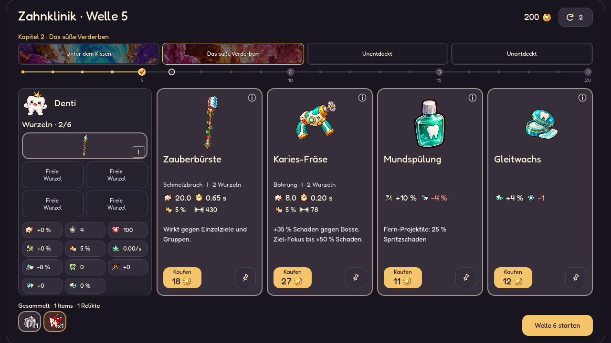
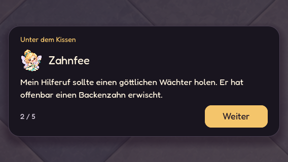
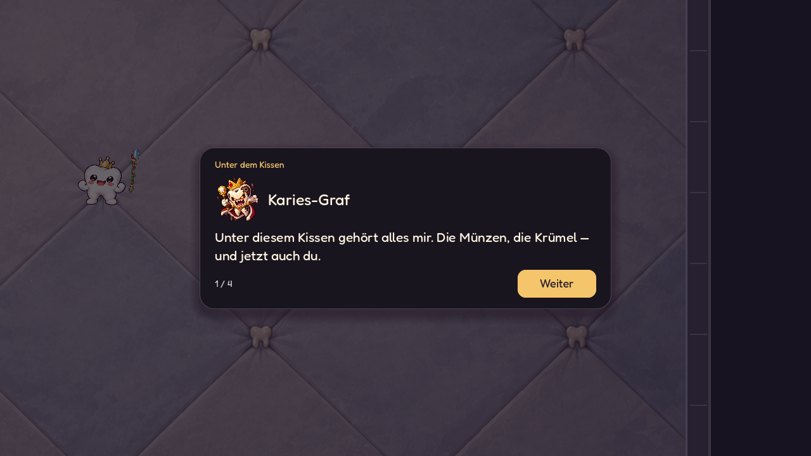
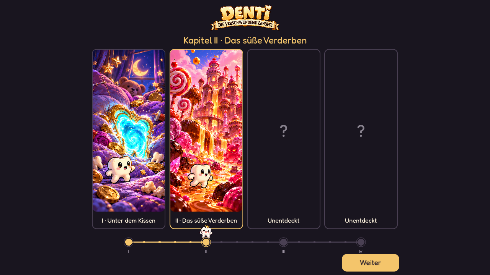
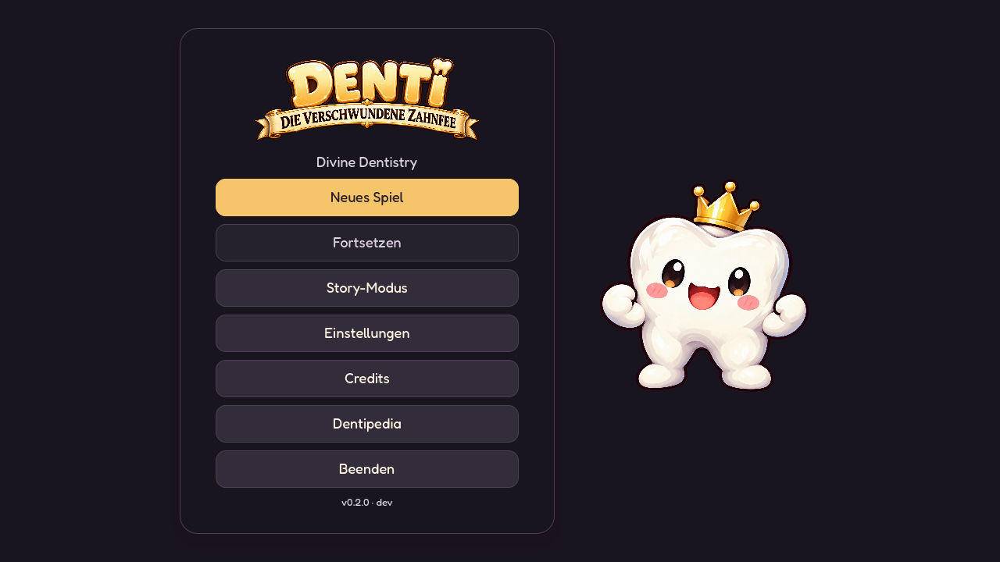
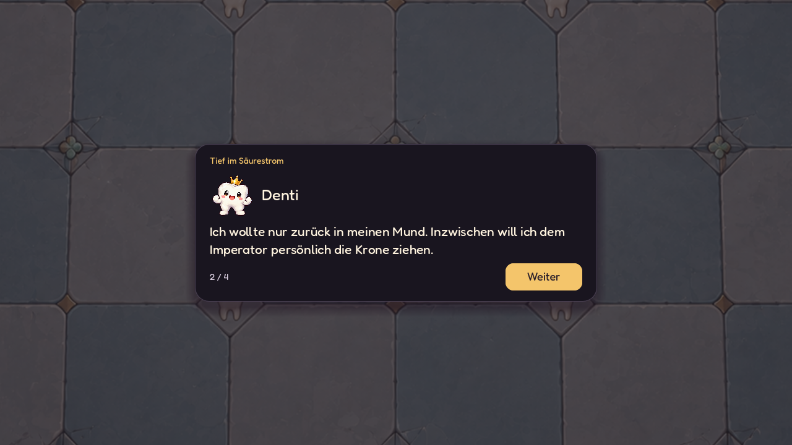

# Story-Modus

Start über **Story-Modus** im Hauptmenü, danach die normale Schwierigkeitswahl.
**Neues Spiel** bleibt der freie Arena-Run. Fortsetzen und Neustart behalten den gewählten Modus.

Denti wird durch einen fehlgeleiteten Hilferuf der gefangenen Zahnfee aus dem Mund geholt.
Er sammelt vier Portalfragmente, um sie zu befreien und nach Hause zu kommen.

## Kapitel und Arenen

| Kapitel | Wellen | Abschluss | Arena |
| --- | --- | --- | --- |
| Unter dem Kissen | 1–5 | Karies-Graf | `assets/environment/story/pillow.png` |
| Das süße Verderben | 6–10 | Karies-Prinz | `assets/environment/story/sugar.png` |
| Tief im Säurestrom | 11–15 | Karies-König | `assets/environment/story/acid.png` |
| Die letzte Krone | 16–20 | Karies-Imperator | `assets/environment/story/palace.png` |

Die Kapitel verwenden die bestehende Gegner- und Bossmechanik. Geometrie, Kollisionen,
Wellenlängen und Balance bleiben erhalten. Böden, Mauern und Außenfarben wechseln bei Ankunft.
Dekoration bleibt am Rand; die Mitte bietet freie Kampffläche.

Zahnfee-Porträt: `assets/story/tooth_fairy.png`, echter Alphahintergrund.
Neue Bilder wurden mit dem integrierten **Imagegen** erzeugt, anhand des vorhandenen Arenabodens
und der kanonischen Denti-Referenz. Originale sind unverändert.
[Gespeicherte Prompts und Referenzen](concepts/story-mode-assets-prompts.md).

## Erkundung und Übergänge

- Im Shop zeigt der Zeitstrahl 20 Wellen und vier größere Bossknoten.
- Vorschaubilder, Namen und Tooltips gibt es ausschließlich für bereits betretene Welten.
  Zukünftige Felder heißen **Unentdeckt** und besitzen keine Textur.
- Nach dem Abschiedsdialog öffnet ein eigener Reisescreen: Denti wandert zum
  nächsten Kapitelknoten; bei Ankunft wird dessen gemalte Karte aufgeklappt.
  Erst dann wechseln Arenaboden und Kapitelname. Spätere Welten bleiben verdeckt.
- **Ankommen** überspringt die Animation; **Weiter** führt zum Ankunftsdialog.
  Bei reduzierter UI-Bewegung wird die Karte sofort statisch enthüllt.
- Die Karten verwenden `assets/story/chapter_cards.png`; der freigestellte
  Goldtitel `assets/story/title.png` erscheint auch im Hauptmenü.
  [Prompts und Referenz](concepts/story-travel-prompts.md) sind gespeichert.
- Die Bildflächen besitzen eigene runde Alphamasken, passend zum Innenradius
  des Rahmens. Das gilt für Reisebilder und Shopvorschauen. Der Reisescreen
  berechnet die Kartenbreite aus dem Bildformat, dem zweipixeligen Rahmen
  und der tatsächlichen Höhe des Titelfeldes.
- Im kurzen Querformat bleiben Kapitelname und komplette Route sichtbar, ohne Vorschaubilder.
- Das Intro kommt vor der Startwaffe. Danach laufen Kämpfe ununterbrochen.
- Vor den Bosswellen 5, 10, 15 und 20 spricht Denti mit dem jeweiligen Herrscher.
  Der kurze Wortwechsel erscheint nach dem Shop, mit dem passenden Boss-Porträt.
  Erst **Kämpfen** startet den Wellentimer und spawnt den Boss. Fortsetzen bewahrt
  den Dialogcursor; ein bereits laufender Kampf wiederholt den Dialog nicht.
- Nach jedem Boss: vollständige Beutesammlung → Levelaufstiege → Kisten → Relikt
  → Abschiedsdialog → Reise/Enthüllung → Ankunftsdialog → Shop.
  Nach Welle 20 ersetzt der Abschlussdialog den Ortswechsel;
  anschließend kommt die bestehende Siegesansicht mit optionalem Endlosmodus.
- Endlos nutzt die letzte Arena und wiederholt keine abgeschlossenen Storydialoge.

## Story-Skript

Das vollständige [Story-/Dialogskript](STORY_SCRIPT.md) enthält alle 42 aktuellen
Dialogzeilen in Spielreihenfolge. Denti entwickelt sich vom Heimkehrwunsch zur
bewussten Konfrontation mit dem Imperator; der König sammelt Zähne als Beute.

## Dialogdarstellung und Sprechlaute

`StoryDialogue` schreibt den Text mit 30–43 Zeichen pro Sekunde, abhängig von der
Figur. Satzzeichen erzeugen kurze Pausen. Das Layout wird am vollständigen Text
berechnet, damit das Fenster beim Schreiben nicht springt.

**Anzeigen** oder ein Klick auf den laufenden Text vervollständigt den Satz.
Erst der nächste Button-Klick geht weiter bzw. startet mit **Kämpfen** die Bosswelle.
Bei reduzierter UI-Bewegung erscheint die Zeile sofort und ohne Sprechlaute.
Auch eine mitten im Satz aktivierte Einstellung beendet den Effekt sofort.

`StorySpeech` erzeugt kurze PCM-Silben mit sechs unterschiedlichen Klangprofilen
für Denti, Zahnfee und die vier Herrscher. Frequenz, Obertonanteil und Sprechtempo
unterscheiden sich. Die Samples werden je Figur einmal erzeugt und gecacht;
kleine Tonhöhenvariationen sind deterministisch und verändern den Gameplay-Zufall nicht.
Leerzeichen/Satzzeichen sind lautlos; ein Mindestabstand verhindert Tonbursts.
Attack/Fade und stille Sample-Endpunkte vermeiden Klickgeräusche.

Sprechlaute laufen über **SFX** und folgen **UI-Töne**, Master- und Effektlautstärke.
Stummschalten stoppt auch einen bereits laufenden Laut. Beim Wechsel einer Zeile,
vollständigen Anzeigen oder Starten des Kampfes stoppt die alte Silbe.

Fortsetzen bewahrt den Dialogcursor und schreibt die aktuelle Zeile erneut,
ohne sie automatisch zu überspringen. Der Charakterindex innerhalb eines Satzes
wird nicht gespeichert.

## Ressourcen und Fortschritt

`StoryChapter`-Resources unter `data/story/` definieren Böden, Farben, Ziel,
Ankunftsdialog und Boss samt Wortwechsel.
`StoryCatalog` enthält Intro, Finale und die Zuordnung zu Bosswellen.
`StoryProgress` hält Kapitel, entdeckte Welten, Dialogcursor und Reisephase.

`PostWaveRewards.Step.STORY` wurde am Ende des Enums ergänzt. Alte gespeicherte
Nummern bleiben gültig; der bestehende Reward-Koordinator entscheidet über die Reihenfolge.
`RunSnapshot` speichert Storyzustand und wartenden Dialog. Alte Saves ohne Storydaten bleiben freie Runs.
Fortsetzen funktioniert vor/nach der Ankunft und mitten in einer Dialogzeile oder Belohnungsentscheidung.
Auch eine gespeicherte Reise setzt ihre Bewegung oder Kartenenthüllung fort;
die abgeschlossene Enthüllung wartet weiterhin auf **Weiter**.

## Prüfung

`tests/story_mode.gd` prüft Intro, Startwaffe, alle vier Bossabschlüsse, lebenden Boss,
Priorität von Level/Kiste/Relikt, Ortswechsel, verdeckte Texturen/Namen/Tooltips,
Fortsetzen, Finale, Endlos und alte Spielstände. Layouts von 320×568 bis 1920×1080,
einschließlich 568×320, werden geprüft.

Nativ gerenderte Vorschauen:

Auch bestanden: smoke, post_wave_rewards, progression_menu, options_menu,
difficulty_levels, shop_grid_layout, shop_interaction, mobile_shop_spacing,
endless_flow und arena_background.

Mit `--capture` erzeugt der Storytest echte Godot-Aufnahmen unter `.godot/story-preview/`.

`tests/story_boss_dialogue.gd` prüft alle vier Herrscher und ihre Porträts,
Dialoglayouts in Hoch-/Querformat, den verzögerten Kampfstart sowie Fortsetzen
mitten im Dialog und während des Bosskampfes. Die vollständige Bosswelle startet
  genau einmal; freie Runs und Endlos behalten ihren bisherigen direkten Wellenstart.
Mit `--capture` entstehen native Aufnahmen unter `.godot/story-boss-preview/`.

`tests/story_travel.gd` prüft alle drei Reisen, verdeckte Ziele, Fortsetzen
vor/nach Ankunft und während der Enthüllung, reduzierte Bewegung, das Hauptmenülogo
und Layouts von 320×568 bis 1920×1080 einschließlich 568×320.
Mit `--capture` entstehen native Aufnahmen unter `.godot/story-travel-preview/`.

`tests/story_dialogue_effects.gd` prüft Schreiben während der Spielpause,
vollständiges Anzeigen vor dem Weitergehen, Satzzeichenpausen, Tonbegrenzung,
sechs unterschiedliche PCM-Profile, alle drei Stummschaltungen, reduzierte Bewegung,
Fortsetzen und die zweite Bestätigung vor dem Bosskampf. Alle überarbeiteten Zeilen
werden vollständig bei 320×568, 568×320 und 1280×720 auf Layoutgrenzen geprüft.
Mit `--capture` werden native Vorschauen und ein Sprechlaut-Demo unter
`.godot/story-dialogue-preview/` erzeugt.

[Klangprobe der sechs synthetischen Sprecher](audio/story-speaking-demo.wav),
in Reihenfolge: Denti, Zahnfee, Graf, Prinz, König, Imperator.
Die Probe zeigt die einzelnen Grundklänge; im Spiel wechseln Tonhöhe und Abstand
mit den geschriebenen Zeichen, bei der eingestellten Effektlautstärke.
