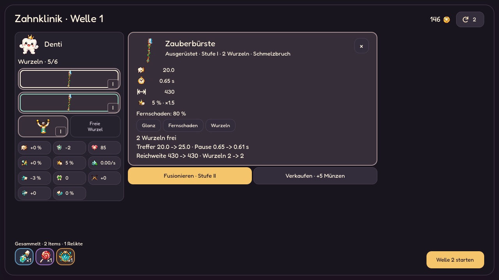
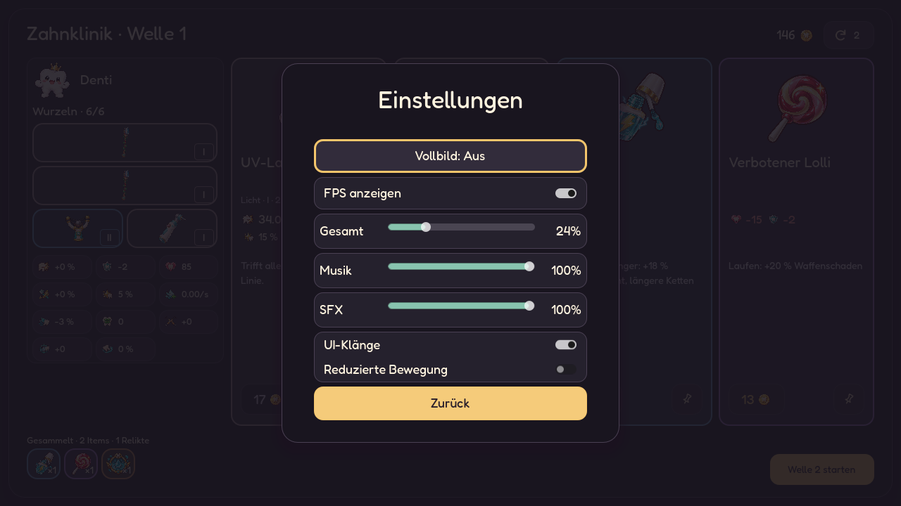

# Denti UI: Göttliche Nachtklinik

Stand: 2. Oktober 2026. Die freigegebene dunkle Richtung ist in Godot umgesetzt.
Die vorherige Browserstudie lieferte die Gestaltung; diese Aufnahmen zeigen
die tatsächlichen Spielansichten mit vorhandenen Spielsystemen.

## Gestaltung

Dunkle Pflaumenflächen, Elfenbeinschrift, Minze für Synergien und warmes Gold
für die Hauptaktion. Große gemalte Motive bleiben im Mittelpunkt. Bestehende
Itematlanten und Icons werden verwendet. Dentis Porträt verwendet den bestehenden
transparenten `denti_unarmed.png`, ohne Hintergrundscheibe oder Bildmaske.
Originalbilder bleiben erhalten.

| Rolle | Farbe |
| --- | --- |
| Hintergrund | `#19151F` |
| Oberfläche | `#25212D` |
| Erhöhte Fläche | `#322C3B` |
| Text | `#FFF4DF` |
| Sekundärtext | `#C5B9CB` |
| Kontur | `#4A4053` |
| Hauptaktion | `#F4C56B` |
| Synergie / XP | `#9ADFC7` |
| Risiko | `#FF968E` |

Shop, Hauptmenü, Kampf, Belohnungen und ESC-Menü bleiben getrennte Ansichten.
Es gibt keine Website-Navigation oder zusätzliche ESC-Schaltfläche im Shop.
Auf Touchscreens gibt kurzes Ziehen auf der freien Spielfläche die Laufrichtung vor,
ohne sichtbares Steuerpad. Solange der Finger liegen bleibt, läuft Denti weiter;
Nachziehen ändert die Richtung. Bei langen Gesten wandert der Bezugspunkt mit,
damit Richtungswechsel erreichbar bleiben. Kleine Fingerbewegungen liegen im
Toleranzbereich. Bewegungstempo und Arenagrenzen gelten weiterhin. Loslassen, Pause oder
Fokusverlust beendet die Geste. UI-Buttons übernehmen ihre eigenen Berührungen.
Die dunkle Gestaltung gilt auch für Tooltips, Auswahllisten, deaktivierte Buttons und Dialoge.

## Informationen und Interaktionen

- Statuswerte und Ressourcen nutzen bestehende Icons mit Zahlen und Einheiten.
  Name, Bedeutung und vollständige Berechnung stehen im Hovertext.
- Vier Shopangebote mit direktem Preisbutton und unabhängigem Pin. Reservierte
  Angebote behalten ihren Preis beim Neuwürfeln und nächsten Shopbesuch.
- Reroll und Münzen stehen in der Kopfzeile. Build und Angebote beginnen auf
  derselben Höhe. Alle vier Karten teilen die Bild-, Namens-, Werte-, Effekt-
  und Preislinien. Auf großen Bildschirmen wächst die Bildfläche; die
  Kartenhöhe bleibt begrenzt, statt leere Säulen zu erzeugen.
- Seltenheit zeigen ein zweipixeliger Kartenrand und eine dauerhaft getönte
  Kartenfläche. Die Tastaturauswahl nutzt eine helle Innenkontur und verändert
  die Seltenheitsfarbe nicht. Der Name bleibt im Hovertext.
  Dasselbe gilt für ausgeklappte Details, ausgerüstete Waffen, gesammelte
  Items, Relikte und Belohnungskarten. Fusionspartner erhalten eine mintfarbene
  Innenkontur; die Auswahl eine helle. Freie Wurzeln bleiben neutral.
  Die frühere Raritätsbox entfällt. Waffen zeigen Schaden, Pause, Crit und
  Reichweite sowie kurze Mechaniktexte aus den tatsächlichen Waffenwerten.
  Kaufkarten zeigen keine Besitzanzahl; diese bleibt an gesammelten Items.
  Reine Stat-Items erklären ihre Boni einmal per Icon und Zahl. Bei zusätzlichen
  Mechaniken wird die erste Mechanik gezeigt, ohne davor die Stat-Zeile zu
  wiederholen. Schaden und Pause sind größer als der Erklärungstext;
  Reichweite nutzt eine einzeilige Icon-Zahl mit Hover-Erklärung.
- Das Wurzelraster hat zwei Spalten und drei Zeilen. Zwei-Wurzel-Waffen
  belegen ganze Zeilen; Einzelwaffen füllen freie Plätze. Die letzte freie
  Wurzel rutscht nicht in eine zusätzliche vierte Zeile. Im Hochformat passen
  alle sechs Wurzeln in eine Reihe, wenn die Breite reicht.
- Kompakte Shopkarten reservieren keine Leerzeilen für fehlende Kategorien,
  Werte oder Effekte. Ihre Höhe folgt dem Inhalt; Preis und Pin bleiben an den
  unteren Ecken und innerhalb einer Rasterzeile auf gleicher Höhe.
- Kisten zeigen eine breite Itemkarte mit vollständigem Effekt neben dem Bild.
  Die Karte bestimmt die Dialoghöhe; Zerlegen ist eine kleinere Aktion darunter.
  Das gilt auch für kurze Querformate.
- Klick auf Angebot, Waffe, Item oder Relikt öffnet die vollständigen Details.
  Waffenvergleich, Synergiehinweise, Stapelzahlen, Verkauf mit Bestätigung,
  Fusion und Auto-Fusion verwenden weiterhin die bestehenden Systeme.
- Klick auf einen Stat oder einen Begriff in den Details öffnet das Dentikon.
  Statdefinitionen stammen aus `DentiAttributes`; aktuelle Werte weiterhin
  aus den vorhandenen Präsentationsfunktionen. Keine zweite Balancequelle.
  Das Infofenster passt seine Höhe dem Text an. Shopdetails öffnen als höchstens
  520 Pixel breites Popup über dem Raster; Kauf, Pin und Ausrüstungsaktionen
  stehen darunter. ESC, Schließen oder Klick außerhalb schließen das Popup.
- ESC schließt zuerst die Details und stellt den Fokus wieder her. Danach
  öffnet ESC das Pausenmenü auch im Shop. Zurückkehren erhält dessen Pause.
- Alle gesammelten Items und Relikte bleiben per Icon, Anzahl und Details
  zugänglich. Details entfernen oder verschieben keine Angebote. Wurzeln und
  Werte passen ohne eigene Scrollleisten.
  Kleine Formate scrollen; Kauf- und Abschlussaktionen bleiben
  erreichbar. Es gibt keine Hoverpflicht auf Touchscreens.

## Bewegung und Klang

Karten und Buttons verzichten auf äußere Schatten und Hover-Leuchten, damit
enge Raster und Scrollbereiche keine farbigen Schattenflächen abschneiden.
Hover hellt Rand und Fläche auf. Freistehende Dialoge behalten ihren Schatten.

Hover vergrößert und dreht das Objektbild leicht; Klicks federn kurz zurück.
Kauf- und Pinbuttons reagieren zusätzlich selbst auf Hover und Fokus. Der
goldene Kaufbutton nennt die Aktion; bei fehlenden Münzen zeigt er „Zu teuer“
mit korallenfarbenem Preis und Rand. Der genaue Fehlbetrag steht im Tooltip
und im Detailfenster. Die Karte trägt ein Infozeichen für den Detailaufruf.
Geöffnete Karten erscheinen in 180 ms. Beim Kauf fliegt das Motiv in 360 ms
zur Sammlung beziehungsweise Ausrüstung. Fusion markiert den Wurzelplatz.
Diese Rückmeldungen sperren keine Eingaben und verändern keine Spielregeln.

Kurze bestehende SFX reagieren auf Hover/Fokus und Klick. Ein 90-ms-Abstand
verhindert Klangsalven; Master- und SFX-Lautstärke bleiben maßgeblich.
**ESC → Einstellungen** enthält „UI-Klänge“ und „Reduzierte Bewegung“.
Beide Optionen werden gespeichert; reduzierte Bewegung beendet laufende
UI-Animationen sofort. Das Hauptmenü öffnet dieselben Einstellungen.

Der Darkmode ist die gewählte Umsetzung. Die helle „Minzklinik“ und eine
System-/Hell-/Dunkel-Auswahl bleiben Ideen aus der Studie und sind nicht
Bestandteil dieser Änderung.

## Prüfung und Vorschau

Die bestehenden Tests prüfen weiterhin Shop, Vierauswahl, Optionen,
Speichern/Fortsetzen, Belohnungsablauf und Gameplay. `tests/nightclinic_ui.gd`
prüft zusätzlich Iconwerte, Pins/Preisbindung, Kartengeometrie und Wurzelplätze
bei 1280×720, 1040×600, 720×1280, 568×320 und 320×568, die echte ESC-Eingabe
während der Shop-Pause, das Dentikon und die Bereinigung der Kaufanimation.
Der Smoke-Test prüft die Textkontraste der Buttons einschließlich disabled.
`tests/ui_text_contrast.gd` prüft mindestens 7:1 Textkontrast auf allen fünf
Seltenheitsflächen in Normal-, Hover-, Druck- und deaktivierten Zuständen,
einschließlich kleiner Seltenheitsnamen und nicht bezahlbarer Preise.
Die variable Fredoka nutzt Gewicht 450 statt des dünnen Standardgewichts 300.
Beschreibungstext ist hell, Nebentext etwas zurückgenommen; Preise bleiben
auch bei deaktiviertem Kauf vollständig lesbar. Fokusrahmen tönen Text nicht.
`tests/shop_grid_layout.gd` prüft gemischte Wurzelkosten einschließlich 5/6,
die gemeinsamen Kartenlinien und das Fehlen einer separaten Rerollzeile bei
1920×1080, 1280×720 und 1040×600.
`tests/mobile_shop_spacing.gd` prüft das kompakte Shopraster und alle Angebote
im Hochformat. `tests/chest_layout.gd` prüft sämtliche Kisten-Items in neun
Fenstergrößen und den anschließenden Wechsel zu anderen Belohnungen.
`tests/shop_interaction.gd` prüft Popupgröße, unveränderte Angebotspositionen,
Kaufhindernisse, eigenes Buttonfeedback und echte Klicks auf Karte/Kaufbutton.

Echte Godot-Aufnahmen erzeugt:

```powershell
Godot_v4.7.2-stable_win64_console.exe --path . --fixed-fps 60 --script res://tools/preview_nightclinic.gd
```

Das Skript verwendet einen getrennten Spielstand und speichert unter
`docs/screenshots/nightclinic_*.png`. Die Aufnahmen wurden auf lesbare Texte,
überlagerungsfreie Kartenaktionen und zugängliche Details geprüft.





