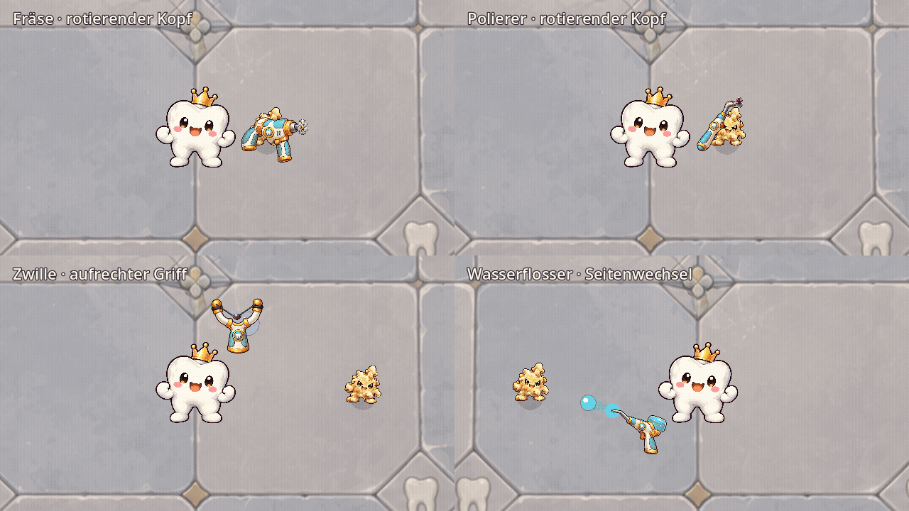
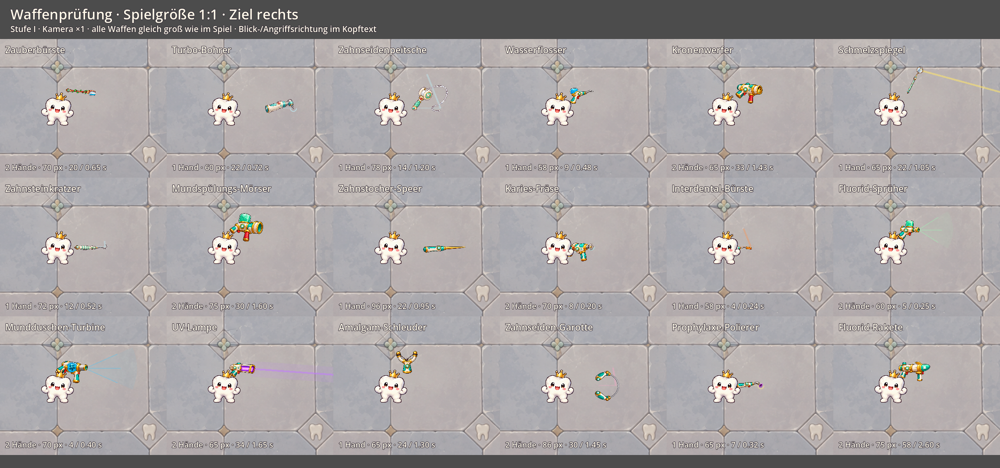

# Waffenüberarbeitung: Form, Haltung und bewegliche Teile

Stand: 1. Oktober 2026. Umsetzung der wichtigsten Befunde aus der [optischen Prüfung aller 18 Waffen](WEAPON_ART_REVIEW.md).

## Neue Grafiken

Acht Waffen verwenden einen neuen gemalten Atlas in der bisherigen Elfenbein-/Türkis-/Goldpalette. Die Originalgrafiken bleiben erhalten.

| Waffe | Anpassung |
| --- | --- |
| Kronenwerfer | Einfacher Lauf mit einer erkennbar geladenen Krone und zwei Griffen; weniger konkurrierende Bauteile. |
| Mundspülungs-Mörser | Ein Mundspülungsbehälter, breite Mündung und zwei Griffe; keine Anhänger oder dauerhaft gemalten Spritzer. |
| Wasserflosser | Schlanker Wasserbehälter und gebogene Dentaldüse; der feste Tropfen entfällt. |
| Fluorid-Sprüher | Grüner oberer Behälter und kurze Sprühdüse; deutlicher von der Turbine unterscheidbar. Die Zweihand-Kosten bleiben bestehen: Pistolengriff und vorderes Gehäuse dienen als Haltepunkte. |
| Mundduschen-Turbine | Blaue Turbinenkammer mit zwei Griffen; klare Wasserwaffe ohne fest gemalten Strahl. |
| Amalgam-Schleuder | Erkennbare Metallkugel im Lederbeutel; Gummibänder und Beutel bewegen sich unabhängig vom starren Griff. |
| Karies-Fräse | Gehäuse und runde Fräsfläche sind separate Grafiken; nur die Arbeitsfläche dreht sich. |
| Prophylaxe-Polierer | Schlankes Handstück und separate violette Polierfläche; keine mitdrehenden Gehäuseausschnitte mehr. |

Fernkampfwaffen ruhen direkt an ihrer Handposition. Die Zauberbürste steht dabei aufrecht. Beim Angriff bleiben die bestehenden Abschussanker und Zielkorrekturen aktiv. Wasser und Sprühnebel werden durch die Angriffseffekte dargestellt.

Die kreisförmigen Arbeitsflächen rotieren vor ihrer elliptischen Projektion. So bleibt die Perspektive des Kopfes am Schaft stabil; seine Kontur kippt nicht mit jeder Umdrehung. Shopicons von Fräse und Polierer werden aus denselben Körper-/Kopfbildern zusammengesetzt, die im Kampf verwendet werden. Alle neuen Icons haben freie Ränder in ihren Atlaszellen.

## Vorschau

Die Animation verwendet die echten Waffeninstanzen und Angriffe mit Kamera-Vergrößerung 1,5. Für die Formprüfung zeigen die folgenden Aufnahmen alle 18 Waffen auf Stufe I bei Kamera-Vergrößerung 1. Angriffseffekte können am Rand einzelner Vergleichsfelder enden.

Weitere Richtungen: [links](screenshots/weapon_art_refinement/all_links_after.png), [oben](screenshots/weapon_art_refinement/all_oben_after.png), [unten](screenshots/weapon_art_refinement/all_unten_after.png). Größere Ansichten: [Ruhehaltung](screenshots/weapon_sizes/all_idle_after.png), [Angriff](screenshots/weapon_sizes/all_attack_after.png).

## Prüfung

Alle **47 Testskripte** bestehen mit Godot 4.7.2. Die Kontaktprüfung umfasst jetzt **224 Kombinationen** aus sieben Waffen, vier Stufen, vier Richtungen und zwei Entfernungen mit der Verkleinerung eines Sechs-Waffen-Builds. Separate Prüfungen sichern die feste Perspektive der Arbeitsköpfe, das Spannen der Schleuder ohne Griffverformung, die Ruhepositionen und freie Iconränder ab. Projektilursprung, Zielrichtung, Fusion, Shopdarstellung und Fortsetzen während eines Angriffs werden durch die bestehenden Tests geprüft.

Der kontrollierte Kontaktbenchmark enthält **60 Messfälle** mit nahen und entfernten normalen Gegnern beziehungsweise Bossen. Trefferzahlen und direkter DPS stimmen in allen Fällen mit dem Stand vor dieser Grafiküberarbeitung überein. Die Rohwerte, Angriffstakte, Skalierungen, Reichweiten und Handkosten bleiben unverändert. [Messdaten vor/nach der Überarbeitung](balance_weapon_art.json).

Einige bestehende Tests melden beim Beenden weiterhin gehaltene Audioressourcen. Die Auswertung prüft Rückgabecode und GDScript-Fehler; die Abschaltwarnungen wurden durch diese Grafikänderung nicht behoben.

## Assets und Wiederholung

- [Neuer Waffenatlas](../assets/weapons/weapon_icons_refined.png): drei Spalten, drei Zeilen, 512 Pixel je Zelle; sechs Fernkampficons und zwei zusammengesetzte Werkzeuge.
- [Animationsteile](../assets/weapons/weapon_animation_parts.png): drei Spalten, zwei Zeilen; oben Gehäuse von Fräse, Polierer und Schleuder, unten Fräsfläche, Polierfläche und Beutel.
- [Exakte Imagegen-Prompts und Referenzen](WEAPON_ART_PROMPTS.md): eingebautes Imagegen mit transparentem Hintergrund. Die generierten Ausgangsbilder liegen unter `assets/weapons/reference/` und werden nicht in den Spielbuild importiert.
- `python tools/pack_weapon_art.py` packt die generierten Objekte mit freiem Zellrand und setzt die beiden Werkzeugicons zusammen.
- `tools/preview_weapon_art.gd` erzeugt die vier Richtungsübersichten; `tools/preview_weapon_sizes.gd` die großen Ruhe-/Angriffsbilder. Beide verwenden getrennte Vorschau-Spielstände.
- `tools/preview_weapon_motion.gd -- --working-heads` nimmt die bewegten Vergleichsbilder unter `.godot/weapon_motion_heads/` auf.

Der frühere Prüfbericht und seine Bilder dokumentieren den Ausgangsstand. Die feinere Zahnseidenanimation, die Kanten der ursprünglichen Peitsche und die Materialdarstellung der Garotte bleiben mögliche spätere Verbesserungen.
