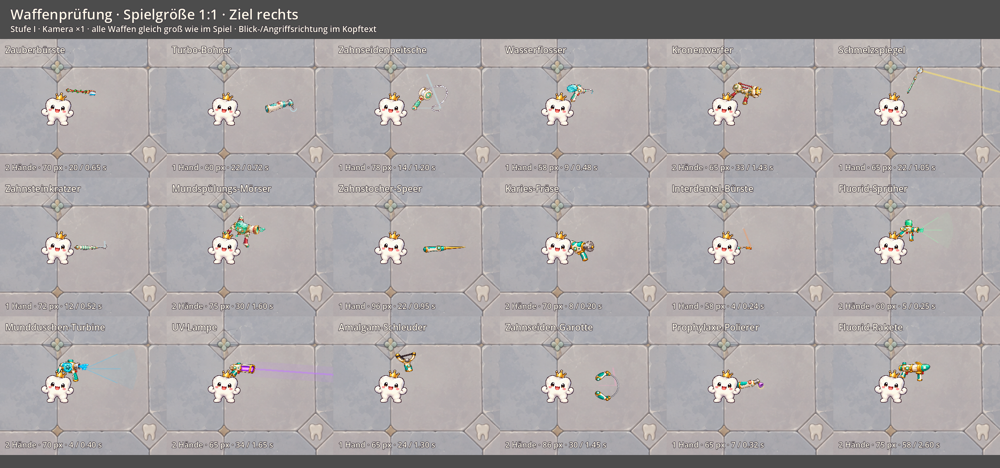
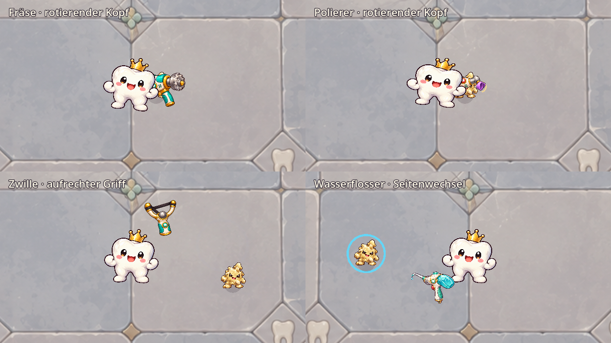

# Optische Prüfung aller 18 Waffen

Stand: 1. Oktober 2026, nach dem [Größen- und Tempo-Pass](WEAPON_SIZE_BALANCE.md). Geprüft wurden die acht Einzelgrafiken, alle zehn Ausschnitte des Erweiterungsatlas, die bestehenden Spielaufnahmen sowie zusätzliche Ansichten in vier Angriffsrichtungen. Fräse und Polierer wurden außerdem in der laufenden Animation betrachtet.

**Die auffälligsten Probleme sind der doppelt gezeichnete Polierkopf, die überladenen Konstruktionen von Kronenwerfer und Mörser sowie der unklare Spannmechanismus der Schleuder.** Hinzu kommen permanent gemalte Spritzer und einige ungünstige Ruhehaltungen. Viele Grundformen funktionieren bereits gut.

Die Prioritäten unten sind eine gestalterische Bewertung. Ein technischer Befund ist ausdrücklich als solcher beschrieben. Fantasietechnik, Goldverzierungen und übertriebene Zahnmedizin gehören zum Spiel; entscheidend sind eine nachvollziehbare Form und Erkennbarkeit im Kampf.

## Übersicht je Waffe

| Waffe | Priorität | Befund | Empfohlene Anpassung |
| --- | --- | --- | --- |
| Zauberbürste | Mittel | Die Zahnbürste ist erkennbar, aber Blätter, Edelsteine und Beschläge werden bei 70 px zu kleinen Farbflecken. Als fast waagerechte schwebende Ruhepose verliert sie den Charakter eines Zauberstabs. | Silhouette behalten, weniger Kleindekor; aufrechtere Ruhehaltung und klarer Übergang zur Schusshaltung. |
| Turbo-Bohrer | Niedrig | Griff, Gehäuse und Bohrkopf sind nachvollziehbar. Der abgewinkelte Kopf passt zur Werkzeugidee. Nach der Verkleinerung wird die kurze Spitze allerdings sehr klein. | Grundgrafik behalten; Spitze etwas deutlicher vom Gehäuse trennen. Keine erneute Vergrößerung der ganzen Waffe. |
| Zahnseidenpeitsche | Mittel | Rolle und Griff sind gut erkennbar. Die feine Zahnseide bleibt während der Rotation eine starre Kurve. Im vergrößerten Original sind graue/violette Saumreste am Faden sichtbar. | Kanten bereinigen, Faden etwas klarer zeichnen; die flexible Zahnseide getrennt vom Griff bewegen. |
| Wasserflosser | Mittel | Tank und gebogene Düse sind eine brauchbare, unterscheidbare Form. Ein einzelner Wassertropfen ist fest in die Grafik gemalt und dreht sich mit dem Werkzeug. | Grundform behalten, Tropfen als separaten Effekt darstellen; Düse und Abschussstelle klarer hervorheben. |
| Kronenwerfer | Hoch | Krone, weiße Halterung, rote Streben, runde Rückseite und zwei Griffe konkurrieren um die Hauptform. Die Kombination liest sich gleichzeitig als Katapult, Armbrust und Blaster. In kleiner Größe wird daraus eine schwer verständliche Gold-Weiß-Masse. | Neu als einfacher Kronenwerfer entwerfen: ein klarer Lauf beziehungsweise eine klare Abschussrinne, eine Krone, zwei nachvollziehbare Haltepunkte. Weniger Beschläge. |
| Schmelzspiegel | Niedrig | Saubere, verständliche Spiegel-/Griffform ohne auffälligen Geometriefehler. Der sehr dünne Stiel und kleine Kopf sind in Spielgröße empfindlich; die Ruhehaltung schwebt weit über Denti. | Grafik weitgehend behalten; Spiegelkopf stärker lesbar und Griff näher an die Hand setzen. |
| Zahnsteinkratzer | Niedrig | Die Werkzeugform und der Haken sind klar. Verzierungen am Griff sind nicht notwendig, stören die Silhouette aber kaum. Die feine Spitze verliert Kontrast auf hellen Böden. | Silhouette behalten, Spitze mit etwas stärkerer Kontur versehen. |
| Mundspülungs-Mörser | Hoch | Tank, großer Lauf, Deckel, zwei knochenartige Griffe, Anhänger und zahlreiche Embleme ergeben ein überladenes Ausstellungsobjekt. In Spielgröße sind Mündung, Griff und Behälter schwerer auseinanderzuhalten. Der Minzspritzer ist permanent Teil des Bildes. | Auf einen deutlichen Tank, einen schweren Lauf und zwei einfache Griffe reduzieren. Spritzer aus der Grundgrafik entfernen und beim Schuss animieren. |
| Zahnstocher-Speer | Niedrig | Eine klare Längsachse verbindet Griff und Spitze; auch beim Drehen bleibt die Funktion erkennbar. Goldspitze und Türkisgriff unterscheiden sich gut. | Als Referenz für einfache, gut lesbare Waffenformen behalten. |
| Karies-Fräse | Mittel | Körper und Fräskopf sind als Werkzeug erkennbar. Die große frontal sichtbare Scheibe wirkt eher wie eine Kreissäge. Technisch liegt ein rotierender Ausschnitt über dem unverändert gezeichneten Kopf; dadurch können Konturen und Reflexe gegeneinander laufen. | Gehäuse behalten; Arbeitskopf als eigene, konsistent perspektivierte Ebene zeichnen und nur den Rotor animieren. |
| Interdental-Bürste | Niedrig | Einfacher Griff, dünner Hals und farblich klarer Bürstenkopf; die Form bleibt in kleiner Größe verständlich. | Behalten; bei Bedarf nur den Bürstenkopf im Kontrast stärken. |
| Fluorid-Sprüher | Mittel | Flasche und Düse sind grundsätzlich nachvollziehbar. Doppelgriff und Gehäuse ähneln anderen Sprühwaffen stark. Die grünen Tropfen bleiben auch in Ruhe an der Mündung stehen. | Festen Spritzer entfernen; mit deutlicher Flaschenform und einfacher Düse vom Wassergerät absetzen. |
| Mundduschen-Turbine | Hoch | Zwei Griffe, Fenster, Rotor, Knöpfe und Mündung liegen auf engem Raum. Im Kampf ähnelt die Silhouette stark dem Fluorid-Sprüher. Der blaue Wasserstrahl ist fest ins Bild eingebaut. | Hauptform um den großen, klaren Turbinenkörper vereinfachen; Griffe deutlicher trennen und Wasserstrahl separat animieren. |
| UV-Lampe | Niedrig | Die violette Leuchtfläche ist ein starkes Unterscheidungsmerkmal. Die Form funktioniert als Fantasie-Strahler; unnötige Lüftungsschlitze und Beschläge sind Kleindekor. | Grundform behalten; Leuchtfläche und Griff stärker gewichten, Kleindekor reduzieren. |
| Amalgam-Schleuder | Hoch | Y-Gabel und Metallkugel sind erkennbar. Der Übergang von den schwarzen Bändern zur Kugel beziehungsweise einer Tasche ist nicht klar; die Kugel wirkt wie ein festes Zierstück. Die Animation dehnt derzeit die ganze Waffe statt eines separaten Spannbands. | Gabel behalten, eine klare Tasche mit Kugel und zwei angebundenen Bandsträngen zeichnen. Tasche/Band bewegen, Griff stabil lassen. |
| Zahnseiden-Garotte | Mittel | Die zwei Griffe und der Bogen sind sauber und verständlich. Das dicke, glänzende graue Verbindungsstück liest sich eher als Stahlkabel denn als Zahnseide. | Griffdesign behalten, Material und Dicke des Fadens ändern; flexiblen Bogen getrennt darstellen. |
| Prophylaxe-Polierer | Hoch | Die Grundform eines kleinen Handgeräts ist brauchbar. Der violette Kopf erinnert eher an eine Trichterdüse. In der laufenden Animation dreht sich ein Ausschnitt inklusive Teilen der Kopfhalterung über der vollständigen Grafik; zusätzliche Gehäuseumrisse machen das Gerät unsauber. | Zuerst die doppelte Kopfzeichnung beheben. Gehäuse und Halterung statisch halten; nur eine klar erkennbare Polierfläche als eigene Ebene animieren. |
| Fluorid-Rakete | Mittel | Raketenform und grüner Kopf sind erkennbar. Gezeichnet sind Rakete und pistolengriffartiger Träger als ein Objekt; dadurch bleibt unklar, was abgefeuert wird und was in der Hand bleibt. Zwei Griffe und viel Gold ähneln weiteren schweren Waffen. | Werfer und geladenes Geschoss gestalterisch trennen; einen einfachen schweren Werfer mit klar sichtbarer Rakete verwenden. |

## Was von der Darstellung im Spiel kommt

- **Ruhehaltung:** Besonders Zauberbürste, Spiegel, Schleuder und mehrere Laufwaffen hängen deutlich oberhalb der sichtbaren Hand. `WeaponMotion.pose()` positioniert bei Fernwaffen die Mündung und leitet daraus die Griffposition ab. Das kann eine brauchbare Grafik unverbunden erscheinen lassen. Eine eigene Ruhepose pro Waffenfamilie sollte die Haltepunkte priorisieren; Zielen und Rückstoß bleiben Teil der Attacke.
- **Rotierende Köpfe:** `WeaponWorkingHead.configure()` verwendet einen kreisförmig maskierten Ausschnitt aus derselben vollständigen Textur und setzt ihn als zusätzliches Sprite auf den Kopf. Die Grundgrafik enthält den Kopf weiterhin. Beim Polierer umfasst der Ausschnitt auch Teile der Halterung. Das ist ein konkreter Aufbaufehler; eine neu erzeugte vollständige Grafik allein würde ihn nicht lösen.
- **Spannung und Flexibilität:** Schleuderband, Peitschenfaden und Garottenbogen sind im Grundbild festgelegt. Die Bewegung der kompletten Textur vermittelt Rotation, aber keinen überzeugenden Auszug beziehungsweise flexiblen Faden.
- **Fest gemalte Effekte:** Wasserflosser, Mörser, Fluorid-Sprüher und Turbine enthalten bereits Tropfen oder Spritzer. Sie bleiben in Ruhe sichtbar und rotieren mit dem Werkzeug. Eine saubere Grundgrafik plus separat ausgelöste Effekte macht den Angriff besser verständlich.

## Perspektive und gemeinsamer Stil

Die einfachen Werkzeuge haben überwiegend brauchbare Achsen und Silhouetten. Die schwereren Waffen mischen viele frontal sichtbare Bauteile mit schrägen Gehäusen; ihre Konstruktion ist besonders beim Drehen schwer lesbar. Eine leichte Dreiviertelansicht passt weiterhin zu Denti, sollte aber je Waffe eine eindeutige Richtung von Griff zu Arbeitskopf haben.

Für die Überarbeitung sollte gelten:

1. Pro Waffe eine starke Hauptform, ein erkennbarer Griff und ein eindeutiger Arbeits-/Abschusspunkt.
2. Gehäuse, bewegliche Teile und Effekte als getrennte Ebenen gestalten.
3. Farben und Materialien gezielt unterscheiden: Wasserbehälter, Lichtfläche, Metallkopf, Borsten und Zahnseide.
4. Die gemeinsame Elfenbein-/Türkis-/Goldpalette erhalten, aber weniger zufällige Knöpfe, Flügel, Kreuze und Edelsteine auf jedem einzelnen Gerät.
5. Jede Variante in der tatsächlichen Spielgröße, als Shopicon und nach Links-/Rechtswechsel sowie Drehungen prüfen. Große, dekorative Originalbilder allein reichen dafür nicht.

Sinnvolle Reihenfolge: zuerst den Polier-/Fräskopf und die Ruhehaltungen technisch bereinigen; danach Kronenwerfer, Mörser und Schleuder gezielt neu gestalten. Turbine und Sprüher benötigen vor allem klarere, unterscheidbare Grundformen und getrennte Effekte. Speer, Interdentalbürste, Kratzer, Bohrer, Spiegel und UV-Lampe bieten brauchbare Ausgangsformen.

## Bildbelege

Die gespeicherten Übersichten verwenden Kamera-Vergrößerung 1 und dieselben Stufe-I-Ressourcen wie das Spiel. Jede Aufnahme zeigt eine feste Angriffsphase; sie dient der Formprüfung. Effekte können an den Grenzen der einzelnen Vergleichsfelder abgeschnitten sein. Die großen [Ruhe- und Angriffsansichten](WEAPON_SIZE_BALANCE.md) ergänzen die Übersicht.

Weitere Richtungen: [links](screenshots/weapon_art_review/links.png), [oben](screenshots/weapon_art_review/oben.png), [unten](screenshots/weapon_art_review/unten.png).

Diese zusätzliche Animation wurde mit `tools/preview_weapon_motion.gd -- --working-heads` aufgenommen. Die oberen beiden Felder zeigen die rotierenden Werkzeugköpfe; die unteren Felder gehören zu den weiteren Beispielen des Vorschauwerkzeugs.

Originalgrafiken: [acht Einzelbilder](../assets/weapons/) und [Atlas der zehn Erweiterungswaffen](../assets/weapons/weapon_icons_expansion.png). Technischer Aufbau: [Haltung und Bewegung](../scripts/weapons/weapon_motion.gd), [überlagerter Arbeitskopf](../scripts/weapons/weapon_working_head.gd), [Kreismaske](../scripts/weapons/working_head.gdshader).
