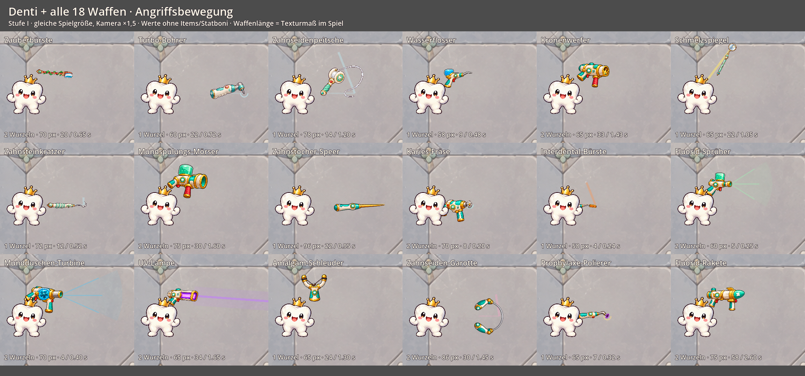

# Waffengrößen und Turbo-Bohrer

Verglichen am 1. Oktober 2026 mit Godot 4.7.2. Alle 18 Waffen sind mit dem echten Denti und ihrer Spiel-Skalierung aufgenommen, jeweils auf Stufe I und bei gleicher Kamera-Vergrößerung von 1,5. Die Angriffsbilder zeigen einen festen Moment der Bewegung; der Bildausschnitt wird für die längeren Vorstöße nach rechts verschoben.

## Vergleich aller Waffen




Die ursprünglichen Aufnahmen stehen hier: [Ruhehaltung vorher](screenshots/weapon_sizes/all_idle_before.png), [Angriff vorher](screenshots/weapon_sizes/all_attack_before.png). Alle Bilder verwenden dieselbe Vergrößerung; die ursprünglichen Vergleichsfelder sind schmaler.

Die angegebenen Pixel beziehen sich auf die längste Texturseite im Spiel, einschließlich transparenter Ränder. Denti wird ungefähr 70 Pixel groß gezeichnet. Die eigenen Ausschnitte, Proportionen und Haltepunkte der Waffen bleiben erhalten; ihre Darstellung wird nicht auf ein gemeinsames Rechteck gestreckt.

| Angepasste Waffe | Bisher im Spiel | Jetzt | Grund |
| --- | ---: | ---: | --- |
| Turbo-Bohrer | 100 px | 60 px | Kompaktes Werkzeug für eine Wurzel statt eines übergroßen Bohrers |
| Zahnsteinkratzer | 100 px | 72 px | Handinstrument näher an Dentis Größe |
| Zahnseidenpeitsche | 100 px | 78 px | Griff und Zahnseide dominieren den Charakter weniger |
| Zahnseiden-Garotte | 100 px | 86 px | Größer als eine Waffe mit einer Wurzel, ohne Denti zu überragen |
| Zahnstocher-Speer | 100 px | 96 px | Bleibt als lange Stichwaffe erkennbar |

Die alten Rohwerte des Bohrers, Speers und der Garotte waren noch größer, wurden aber schon vom gemeinsamen 100-Pixel-Limit begrenzt. Die neuen Werte liegen direkt in den Waffenressourcen. Bei vielen Waffen greift zusätzlich die bestehende Verkleinerung bis zu 12 %. Die übrigen 13 Waffen behalten ihre Größe.

## Kleinerer, schnellerer Bohrer

| Stufe I, ohne Stats und Items | Vorher | Jetzt |
| --- | ---: | ---: |
| Basisschaden pro Treffer | 33 | 22 |
| Angriffspause | 1,28 s | 0,72 s |
| Dauer der Angriffsbewegung | 0,38 s | 0,22 s |
| Skalierung mit Nahschaden | 150 % | 100 % |
| Reichweite | 160 | 160 |
| Bossbonus | +25 % | +25 % |
| Direkter Dauer-DPS ohne Crit | 25,8 | 30,6 |

Der Angriffstakt steigt theoretisch um 78 %. Der Schaden je Treffer und die Skalierung roher Nahschaden-Punkte sinken auf zwei Drittel. Dadurch wächst der direkte Dauer-DPS um rund 18,5 %, statt durch das höhere Tempo fast verdoppelt zu werden. Die bisherigen Schadenskurven und der Bossbonus bis +40 % auf Stufe IV bleiben erhalten; der Bohrer kostet weiterhin eine Wurzel.

Ein kontrollierter 12-Sekunden-Durchlauf misst **17 statt 10 Treffer**, **31,2 statt 27,5 direkten DPS** gegen normale Gegner und **39,0 statt 34,4 gegen einen Boss ohne Schutzphasen**. Die endliche Messdauer und sofortige erste Attacke ergeben ein Plus von 13,3 %. Diese Werte sind direkte Kontaktmessungen, keine Siegquote oder vollständige Rangliste einschließlich Items, Blutung und anderer Synergien.

## Kontakt und Bossbalance

Die verkleinerten Sprites behalten ihre Reichweite über die Angriffsbewegung. Die neuen Prüfungen decken nahe Ziele und die Reichweitengrenze in allen vier Richtungen, auf allen vier Stufen und mit der Verkleinerung eines Sechs-Waffen-Builds ab. Treffer entstehen weiterhin erst nach dem Ausholen.

Dabei wurde eine tote Zone bei kurzen Rundum- und Bogenschnitten sichtbar: Auf hohen Stufen konnte der Griff weiter außen kreisen als ein sehr nahes Ziel. Die Griffbewegung berücksichtigt jetzt die Entfernung zum gewählten Ziel; entfernte Ziele verwenden weiterhin die volle Ausladung. Die bestehenden Mehrziel- und Blutungsprüfungen bleiben erhalten.

Der erneut gemessene gemischte Sechs-Wurzel-Build aus dem [Schadensbericht](DAMAGE_DEFENSE_BALANCE.md) besiegt die Bosse in Welle 5/10/20 nach **18,2 / 23,4 / 46,9 Sekunden**. Schutzphasen, Adds und Angriffe sind dabei aktiv. Der schnellere Bohrer macht diese Begegnungen damit im Beispielbuild weiterhin nicht zu Kämpfen von 2–5 Sekunden. Bewegte Gegner und spezialisierte Builds benötigen weiterhin Spieltests.

## Vorschau und Messung wiederholen

`tools/preview_weapon_sizes.gd` rendert die beiden Übersichten unter `docs/screenshots/weapon_sizes/` sowie einzelne Bilder jeder Waffe unter `.codex/weapon_sizes/`. Das Werkzeug verwendet einen getrennten Vorschau-Spielstand. Für einen Ausgangsstand vor zukünftigen Anpassungen kann `-- --before` angehängt werden.

```powershell
Godot_v4.7.2-stable_win64_console.exe --path . --script res://tools/preview_weapon_sizes.gd
Godot_v4.7.2-stable_win64_console.exe --headless --path . --script res://tools/benchmark_weapon_contact.gd
```

Der Kontakt-Benchmark prüft fünf Nahkampfwaffen gegen ein stehendes normales Ziel und einen Boss, jeweils links/rechts, auf drei Entfernungen und mit 60 Schritten pro Sekunde. Gegner-KI, Crit-Chance des Spielers, Items und Blutungs-Ticks sind ausgeschaltet; eigene Waffenmechaniken wie Politur und Fokus bleiben aktiv. Der Zufallsstartwert wird pro Fall zurückgesetzt. Beide Messstände sind in [balance_weapon_sizes.json](balance_weapon_sizes.json) gespeichert. Die Testsuite umfasst weiterhin 46 Tests; `weapon_motion.gd` enthält jetzt zusätzlich die 160 Kontaktfälle für kompakte Waffen.
